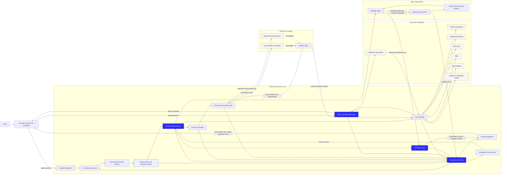

<aside>
🧠

Adham should use **YoAgent as the Rust execution-kernel reference** and **DeepSeek Harness as the durable architecture and behavioral reference**. Adham should not copy either product wholesale; it should combine their strongest patterns behind Adham’s stricter project isolation, privacy routing, policy, audit, and verification contracts.

</aside>

## Audit scope

Repositories reviewed at pinned revisions:

- DeepSeek Harness: `5badb15` — agent loop, session/event model, persistence, projections, request construction, tool execution, cancellation, retry, compaction, sandbox policy, subagents, jobs, goals, and format migrations.[[1]](https://github.com/deepseek-ai/deepseek-harness/tree/5badb15)
- YoAgent: `f6aa41c` — Rust agent builder, loop, streaming provider trait, tools, dynamic tool sources, retry, execution limits, context management, branching session model, skills, MCP/OpenAPI integration, subagents, and path sandbox.[[2]](https://github.com/yologdev/yoagent/tree/f6aa41c)

The detailed read focused on P0 business-logic source and its contract tests. Generated files, translations, lockfiles, snapshots, and documentation copies were inventoried but are not treated as independent business logic.

Both repositories use the MIT License, so their ideas and code can be reused subject to preserving the required copyright and license notices.[[3]](https://github.com/deepseek-ai/deepseek-harness/blob/5badb15/LICENSE)[[4]](https://github.com/yologdev/yoagent/blob/f6aa41c/LICENSE)

# 1. Executive decision

## Use YoAgent for the inner kernel

YoAgent is closest to Adham’s required implementation language and already provides a compact Rust foundation for:

- Streaming provider abstraction.
- Model/tool loop execution.
- Sequential and parallel tool calls.
- Retry classification and backoff.
- Execution limits and repeated-call detection.
- Skills and dynamic tool sources.
- MCP and OpenAPI tool integration.
- Subagents exposed as tools.
- Cancellation and queued steering/follow-up input.

Its code is easier to adapt into an Adham-owned Rust runtime than translating a large TypeScript package graph.[[5]](https://github.com/yologdev/yoagent/blob/f6aa41c/src/agent_loop.rs)[[6]](https://github.com/yologdev/yoagent/blob/f6aa41c/src/provider/traits.rs)

## Use DeepSeek Harness for durable semantics

DeepSeek Harness has the stronger system-level design for:

- Append-only session events as the source of truth.
- Rebuilding each request from persisted session state.
- Synchronous projections over durable events.
- Explicit turn, step, attempt, tool-call, retry, and cancellation events.
- Resumable sessions and session format migrations.
- Tool ordering and bounded parallelism.
- Compaction without destroying canonical history.
- Exact-action sandbox escalation.
- Modular packages and extension seams.

These patterns solve the reliability problems Adham is specifically intended to fix: agents claiming work is done, context drifting, retries duplicating effects, hidden state leaking across projects, and sessions becoming impossible to resume or audit.[[7]](https://github.com/deepseek-ai/deepseek-harness/blob/5badb15/packages/core/agent-loop/src/agent.ts)[[8]](https://github.com/deepseek-ai/deepseek-harness/blob/5badb15/packages/core/agent-loop/src/tool-calls.ts)

# 2. Core comparison

| Area | YoAgent | DeepSeek Harness | Adham decision |
| --- | --- | --- | --- |
| Runtime language | Rust | TypeScript | Rust |
| Agent loop | Compact library loop | Modular durable driver | YoAgent-shaped kernel with DeepSeek semantics |
| Session authority | In-memory branching session, JSONL serialization | Append-only event log with projections and persistence | Durable append-only event log |
| Branching | Parent-linked message DAG | Session fork and event history | Event-log fork with explicit checkpoint identity |
| Provider abstraction | Strong `StreamProvider` trait | Adapter/package ecosystem | Rust provider trait plus capability metadata |
| Tool execution | Sequential/batched execution | Ordered, exclusive, bounded parallel groups | Explicit tool scheduling contract |
| Retry | Provider classification and buffered stream retry | Durable retry lifecycle events | Both: buffered retry plus persisted attempt events |
| Context pressure | Truncate, summarize, drop-middle | Compaction packages and projections | Non-destructive compaction recorded as events |
| Subagents | Subagent as an `AgentTool` | Dedicated lifecycle and multiple drivers | Delegation tool backed by isolated child sessions |
| Sandbox | Path-root checks | Policy providers, OS implementations, escalation flow | OS sandbox plus policy engine; path checks are only one layer |
| Extensions | Tools, skills, MCP, OpenAPI | Broad package/plugin seams | Agent Plugins + Skills + MCP, mediated by policy |

# 3. Required Adham P0 architecture

## 3.1 Immutable execution identity

Every run must carry an immutable identity tuple:

```
installation_id
organization_workspace_id
team_workspace_id
project_id
session_id
agent_id
run_id
turn_id
step_id
attempt_id
```

Provider clients, tool registries, memory, filesystem roots, budgets, and policy snapshots are built from this identity. They must never be inferred from whichever project is currently visible in the UI.

## 3.2 Canonical event log

The event log—not UI state, model history, or mutable agent objects—is the source of truth.

Minimum event families:

- Session created, resumed, forked, archived.
- User input queued, edited, claimed, or canceled.
- Turn and step started or ended.
- Request context and policy snapshot created.
- Model attempt started, streamed, retried, failed, or completed.
- Tool requested, authorized, started, progressed, completed, denied, or failed.
- Agent delegated, paused, redirected, reported, or stopped.
- File patch proposed, applied, rejected, or rolled back.
- Compaction and memory proposal created.
- Verification started, passed, failed, or waived.
- Checkpoint created or restored.

Events need stable schemas, monotonically increasing sequence numbers, version migrations, checksums, and atomic persistence.

## 3.3 Derived projections

UI and runtime views are projections over the log:

- Conversation surface.
- Current inbox and queued instructions.
- Active plan and task graph.
- Running agents.
- Tool-call history.
- File-change set.
- Cost and token usage.
- Context pressure.
- Approval inbox.
- Completion and verification status.

A projection can be rebuilt. It must never contain the only copy of important state.

## 3.4 Deterministic turn state machine

Use the lifecycle:

```
queued → preparing → requesting → streaming → tool scheduling
→ tool execution → observation → next step | verification | completed
```

Every transition is legal only from named states. Cancellation, provider failure, policy denial, and application shutdown each have explicit transitions and terminal reasons.

## 3.5 Tool scheduling contract

Every tool declares:

- Read-only or side-effecting.
- Parallel-safe or exclusive.
- Idempotency and retry behavior.
- Required capabilities.
- Filesystem and network scope.
- Cost and timeout class.
- Result-size policy.
- Compensation or rollback support.

Parallel-safe calls may run within a configured bound. Exclusive or order-dependent calls preserve model order. A retry must not repeat an uncertain side effect unless the tool has an idempotency key or a verified safe recovery path.

## 3.6 Policy before execution

The model may request an action but never authorizes it. The trusted Rust core resolves:

```
request → normalized action → policy evaluation → approval if needed
→ sandbox grant → execution → audit event
```

A permission escalation applies to the exact normalized action, the narrowest sufficient capability, and a defined duration. Denial should keep the task alive when a permitted alternative exists.

## 3.7 Provider gateway and privacy routing

Provider adapters expose capability metadata: modalities, context size, tool support, pricing, region, data policy, streaming, and error classes.

The routing engine receives only approved context and a frozen policy snapshot. Fallback may happen automatically inside the same permitted privacy class. Local-to-cloud movement requires an explicit pre-existing rule or a new approval.

## 3.8 Non-destructive context management

Compaction must never rewrite or delete canonical history. It emits a summary or replacement projection tied to exact source sequence ranges, model, prompt version, and token accounting.

Large tool outputs should be stored as artifacts; the model receives a bounded excerpt plus a retrievable reference. This avoids context bloat without losing evidence.

## 3.9 Isolated subagents

A subagent is a child session with:

- A focused objective and bounded context shard.
- Its own event stream, budget, tool grants, and cancellation token.
- No implicit access to parent mutable state.
- Structured progress and final-report contracts.
- Explicit artifact and evidence handoff.

Only approved results return to the manager. Shared mutable state must be replaced by capability handles or audited message passing.

## 3.10 Verification-gated completion

An agent cannot mark a task complete merely because it produced text or changed files. Completion requires a task-specific contract, for example:

- Required outputs exist.
- Build, tests, types, and lint were run where applicable.
- File changes stay inside scope.
- Destructive actions are accounted for.
- A reviewer or verifier checked the result.
- Unverified conditions are reported honestly.

The final state distinguishes **completed**, **completed with warnings**, **blocked**, and **failed verification**.

# 4. What to adopt and what to change

## Adopt from YoAgent

- Rust-first builder and trait ergonomics.
- `StreamProvider`-style provider boundary.
- Structured stream events.
- Provider error classification.
- Retry-safe event buffering.
- Dynamic tool sources.
- Skill discovery and loading.
- Subagents represented through the tool interface.
- Execution limits and repeated-tool detection.

## Strengthen before Adham use

- Replace the in-memory session as authority with durable events.
- Persist attempt, retry, policy, approval, and tool lifecycle states.
- Replace simple path-root sandboxing with native OS isolation and brokered capabilities.
- Do not share arbitrary mutable state between parent and child agents.
- Add idempotency and uncertain-side-effect recovery.
- Separate model-visible errors from private diagnostics.
- Make context identity mandatory at every provider and tool boundary.

## Adopt from DeepSeek Harness

- Every request reconstructed from session history.
- Append-only event model and synchronous projections.
- Turn/step/attempt lifecycle.
- Cancellation that preserves already delivered output.
- Explicit inbox/queued-input semantics.
- Bounded parallel tool execution with exclusivity.
- Session persistence, migrations, repair, and checkpoints.
- Compaction as a projection over history.
- Exact-action escalation.

## Do not copy directly

- The full TypeScript package topology into the Rust core.
- Product-specific provider assumptions.
- Any implicit global context.
- Plugin code inside the trusted runtime.
- UI concerns inside the execution state machine.

# 5. Proposed Rust crates

```
adham-core-types        IDs, events, errors, capability descriptors
adham-event-log         append, transaction, checksum, replay, migrations
adham-projections       conversation, tasks, usage, approvals, artifacts
adham-runtime           turn/step/attempt state machine
adham-provider          provider traits and stream normalization
adham-router            model selection, privacy classes, fallback
adham-tools             tool registry and scheduler
adham-policy            inheritance, decisions, approvals, snapshots
adham-sandbox           platform sandbox providers and capability broker
adham-context           assembly, retrieval, budgeting, compaction
adham-agents            definitions, delegation, reporting contracts
adham-memory            local memory proposals, retrieval, provenance
adham-verify            completion contracts and verifiers
adham-artifacts         immutable large outputs and file patches
adham-extensions        Skills, MCP, Agent Plugins, trust and grants
adham-secrets           OS credential-vault broker
adham-desktop-ipc       narrow typed interface exposed to the frontend
```

The desktop frontend must communicate with these crates through typed commands and event subscriptions. It must not mutate runtime state directly.

# 6. P0 implementation order

1. **Core identifiers and event schemas.**
2. **SQLite/WAL event store** with replay, checksums, transactions, migrations, and crash tests.
3. **Projection engine** and conversation/task/approval projections.
4. **Single-agent loop** with turn, step, attempt, cancellation, queueing, and checkpoints.
5. **Provider gateway** with Ollama Local plus one cloud provider first; normalize errors and streaming.
6. **Tool scheduler and policy engine** with read-file, write-patch, and terminal tools.
7. **Native sandbox boundary** and exact-action approval flow.
8. **Context budgeting and artifact-backed tool results.**
9. **Verification contracts** before completion.
10. **Child-session subagents** only after the single-agent runtime passes recovery and isolation tests.
11. **Skills and MCP** after the permission broker is stable.
12. **Plugins and marketplace** after package trust, sandboxing, and updates are stable.

# 7. P0 release gates

- Killing Adham during every state can resume without duplicating a side effect.
- Two simultaneously running projects cannot see each other’s paths, memory, tools, prompts, or queued work.
- Cancellation preserves visible streamed output and records a terminal reason.
- A provider retry does not duplicate user-visible stream events.
- Local-to-cloud fallback never occurs without policy or approval.
- Tool calls obey order, exclusivity, timeout, and idempotency declarations.
- Compaction can be removed and rebuilt from canonical history.
- A subagent cannot access parent capabilities that were not delegated.
- A task cannot become completed until its verification contract resolves.
- Every externally visible action can be explained from the event log.

# 8. Immediate next technical artifacts

Before implementation, create:

1. Event taxonomy and JSON/Serde schemas.
2. Runtime state-transition table.
3. Tool capability and idempotency contract.
4. Policy decision request/response schema.
5. Provider trait and normalized stream-event schema.
6. Project isolation threat model.
7. Crash/retry/cancellation test matrix.
8. Verification contract for the first coding task.

These eight artifacts are the minimum needed to turn the current product design into an implementable and testable core.

# 9. P0 main business-logic sketch

The diagram below shows the complete P0 control path. The trusted Rust core remains between the frontend, models, tools, files, and credentials. Every meaningful transition is committed to the event log and then projected back into the UI.



## How to read the sketch

1. The frontend submits a typed command; it never changes runtime state directly.
2. The core binds the command to immutable workspace, project, session, agent, run, turn, step, and attempt identifiers.
3. The runtime assembles only authorized context and chooses an allowed model.
4. Model tool requests pass through scheduling, policy, approval, credential brokering, and sandbox enforcement.
5. Delegation creates isolated child sessions rather than sharing an agent’s mutable context.
6. Every transition is appended to the canonical event log.
7. UI surfaces are rebuildable projections of that log.
8. Verification—not the model’s claim—decides whether work is complete.