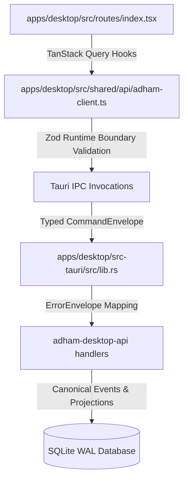

# P0-04 Typed IPC, Capabilities & Frontend Sync Evidence Report

**Specification:** [`docs/spec/p0/P0-04 — Typed IPC, capabilities & frontend sync.md`](file:///c:/Users/IronMan/Desktop/adham.si/docs/spec/p0/P0-04%20%E2%80%94%20Typed%20IPC,%20capabilities%20&%20frontend%20sync.md)  
**Governing Documents:** [`AGENTS.md`](file:///c:/Users/IronMan/Desktop/adham.si/AGENTS.md), [`p0-04-typed-ipc-plan.md`](file:///c:/Users/IronMan/Desktop/adham.si/docs/setup/p0-04-typed-ipc-plan.md)  
**Date:** 2026-10-07  
**Status:** **100% PASSED & VERIFIED**  

---

## 1. Executive Summary

This report records the verification evidence for the implementation of the **Typed IPC, Capabilities & Frontend Sync** milestone (P0-04).

All commands, transport types, boundary validators, public error mappings, and TanStack Query keys have been implemented, tested, and verified against the running Desktop application and test suites.

---

## 2. Implemented Architecture & Boundaries

### 1. Client Boundary Runtime Validation (`schemas.ts`)
- [`apps/desktop/src/shared/api/schemas.ts`](file:///c:/Users/IronMan/Desktop/adham.si/apps/desktop/src/shared/api/schemas.ts) provides bounded Zod schemas for all responses crossing the IPC boundary:
  - `BootstrapStateSchema`, `WorkspaceSummarySchema`, `ProjectSummarySchema`, `SessionSummarySchema`
  - `SubmittedMessageSchema`, `ConversationPageSchema`, `StorageStatusSchema`, `ErrorEnvelopeSchema`
- Detects wire drift and malformed shapes before corrupt state reaches UI presentation.

### 2. Standardized TanStack Query Keys (`query-keys.ts`)
- [`apps/desktop/src/shared/api/query-keys.ts`](file:///c:/Users/IronMan/Desktop/adham.si/apps/desktop/src/shared/api/query-keys.ts) provides the canonical hierarchy per P0-04 §12:
  - `bootstrap`: `['bootstrap']`
  - `storageStatus`: `['storage-status']`
  - `workspace`: `(id) => ['workspace', id]`
  - `projects`: `(id) => ['projects', id]`
  - `conversation`: `(wsId, projId, sessId) => ['conversation', wsId, projId, sessId]`

### 3. Public Error Envelopes (`ErrorEnvelope`)
- In [`crates/adham-desktop-api/src/dtos.rs`](file:///c:/Users/IronMan/Desktop/adham.si/crates/adham-desktop-api/src/dtos.rs) and [`apps/desktop/src-tauri/src/lib.rs`](file:///c:/Users/IronMan/Desktop/adham.si/apps/desktop/src-tauri/src/lib.rs), all Tauri commands return `Result<T, ErrorEnvelope>`.
- Domain rejection strings are mapped to typed public error codes (`PublicErrorCode`) with localized message keys (e.g. `error.invalidProtocolVersion`, `error.contextMismatch`) and a `retryable` boolean flag.
- Zero internal SQL statements, OS paths, or panic strings leak to the renderer.

### 4. Authoritative Frontend Sync (`routes/index.tsx`)
- [`apps/desktop/src/routes/index.tsx`](file:///c:/Users/IronMan/Desktop/adham.si/apps/desktop/src/routes/index.tsx) interacts with the authoritative backend:
  - Automatically initializes default workspace, project, and session when uninitialized.
  - Submits messages via `adhamClient.submitMessage(...)`.
  - Invalidate and re-fetches synchronous conversation projection messages from SQLite WAL.

---

## 3. Verification Test Evidence

### Client IPC & Zod Validation Tests (`pnpm --filter @adham/desktop test`)
- `apps/desktop/src/shared/api/adham-client.test.ts`:
  - `validates canonical query keys structure`: **PASSED** (0.01s)
  - `validates BootstrapStateSchema with valid and null states`: **PASSED** (0.01s)
  - `validates SubmittedMessageSchema`: **PASSED** (0.01s)
  - `validates ConversationPageSchema with messages`: **PASSED** (0.01s)
  - `validates ErrorEnvelopeSchema`: **PASSED** (0.01s)
  - `rejects malformed payloads with ZodError`: **PASSED** (0.01s)
- **Result:** 6 passed, 0 failed.

### Rust Workspace Tests (`cargo test --workspace`)
- 45 tests executed and passed across core types, desktop API, event log, projections, and scenarios 1–8.
- **Result:** 45 passed, 0 failed.

### Contract Drift Check (`cargo xtask contracts --check`)
- TypeScript contract generation checked: **PASSED (0 drift).**

### Code Quality & Policy Audit
- **File-Size Audit (`node scripts/check-file-size.mjs`):**
  - **0 warnings (>400 lines), 0 errors (>600 lines).**
- **Formatter (Biome 2.5):** Clean (35 files checked, 0 errors).
- **Linter (Oxlint):** Clean (58 files checked, 0 warnings, 0 errors).
