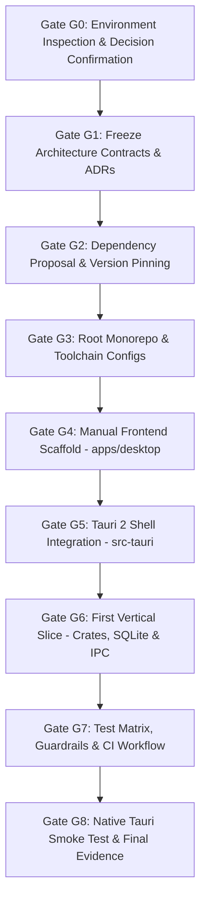

# Adham Initial Setup & Repository Scaffolding Plan

> **Authority & Governance Notice:**  
> Per [`AGENTS.md`](file:///c:/Users/IronMan/Desktop/adham.si/AGENTS.md) and [`P0 — Implementation decisions & execution order.md` §5](file:///c:/Users/IronMan/Desktop/adham.si/docs/spec/p0/P0%20%E2%80%94%20Implementation%20decisions%20&%20execution%20order.md#L382-L401), implementation execution is strictly gated. All six baseline governance decisions were formally approved.

---

## 1. Six Baseline Governance Decisions

| # | Decision Item | Confirmed Baseline | Human Approval Status |
|---|---|---|---|
| **1** | **Repository License** | **Apache-2.0** (permissive, patent-granting, sponsor-friendly) | Approved |
| **2** | **Runtime Toolchain** | **Node 24 LTS** baseline for reproducible development; host verified on Windows | Approved |
| **3** | **IPC Type Generation** | **`ts-rs`** for P0 transport DTOs generating to `packages/contracts-generated/` | Approved |
| **4** | **Scaffolding Method** | **Manual Vite/React 19 setup**, followed by `pnpm tauri init` (clean layout control) | Approved |
| **5** | **IPC Command Boundary** | **Domain-specific commands only** (`submit_message`, `create_workspace`, etc.; never expose raw `append_session_event`) | Approved |
| **6** | **Dependency Authorization** | Verified packages against registry.npmjs.org; modern stack (Biome 2, Vitest 5, TypeScript 7) | Approved |

---

## 2. Phased Execution Roadmap

---

### Phase 0: Gate G0 — Inspect & Establish Authority
**Status: COMPLETED**
- Recorded findings in `docs/reports/toolchain-inventory.md`.
- Detected: `rustc 1.96.0`, `cargo 1.96.0`, `node 26.4.0`, `pnpm 10.33.2`, `git 2.55.0`, MSVC Build Tools 2026, WebView2 Runtime `154.0.4258.53`.

---

### Phase 1: Gate G1 — Freeze Contracts & Architecture Decision Records (ADRs)
**Status: COMPLETED**
- Modular monolith architecture in Cargo + pnpm workspaces.
- Seven allowed IPC commands frozen: `get_bootstrap_state`, `get_storage_status`, `create_workspace`, `create_project`, `create_session`, `submit_message`, `get_conversation`, `admin_rebuild_projections`.

---

### Phase 2: Gate G2 — Dependency Proposal & Review
**Status: COMPLETED**
- Pinned and verified against live npm registry:
  - Biome `2.5.15`
  - Vitest `5.0.3`
  - TypeScript `7.0.2`
  - Oxlint `1.87.0`
  - React `19.3.0` & React-DOM `19.3.0`
  - TanStack Router `1.168.42` & Router Plugin `1.168.42`
  - TanStack Query `5.104.1`
  - Tauri API `2.12.1` & Tauri CLI `2.12.1`
  - i18next `26.4.2` & react-i18next `17.0.16`
  - Tailwind CSS `4.3.3` & @tailwindcss/vite `4.3.3`
  - Zod `4.6.5`

---

### Phase 3: Gate G3 — Root Monorepo & Configuration Foundation
**Status: COMPLETED**
- Root `.gitignore`, `.editorconfig`, `rust-toolchain.toml`, `clippy.toml`, `deny.toml`, `LICENSE`, `README.md`, `SECURITY.md`, `CONTRIBUTING.md`, `CODE_OF_CONDUCT.md`.
- `pnpm-workspace.yaml`, `tsconfig.base.json`, `biome.json`, `oxlint.json`.
- Internal packages:
  - `packages/tsconfig`
  - `packages/contracts-generated`
  - `packages/design-tokens`
  - `packages/ui`

---

### Phase 4: Gate G4 & G5 — Frontend Scaffold & Desktop Shell
**Status: COMPLETED**
- `apps/desktop`: React 19 UI with TanStack Router, TanStack Query, i18n, typed Tauri API client.
- `apps/desktop/src-tauri`: Tauri 2 shell wiring the IPC commands, Windows resource icon generation, strict CSP.

---

### Phase 5: Gate G6 — First Vertical Slice
**Status: COMPLETED & VERIFIED**
- `crates/adham-core-types`: Strongly-typed UUIDv7 identifiers, error types, canonical event payloads.
- `crates/adham-platform`: Windows `%LOCALAPPDATA%\Adham\data` directory management.
- `crates/adham-event-log`: SQLite WAL, BLAKE3 checksum chaining, sensitive content segregation, concurrency conflict guards.
- `crates/adham-projections`: Synchronous conversation projection and deterministic rebuild from raw canonical events.
- `crates/adham-desktop-api`: Transport DTOs deriving `TS`, modular command handlers.
- `xtask`: `cargo xtask contracts` generator producing `packages/contracts-generated/src/index.ts`.

---

### Phase 6: Gate G7 & G8 — Testing, Toolchain Hardening & Native Smoke
- **Gate G7 (Test Matrix & Quality Guards):** **PASSED**
  - `cargo test --workspace`: 35 tests passed (100% pass rate: BLAKE3 checksum chaining, SQLite WAL storage, conversation projections, typed IPC contracts).
  - `node scripts/check-file-size.mjs`: 0 warnings, 0 errors (<300 line policy strictly satisfied across the monorepo).
  - `pnpm format:check` & `pnpm lint`: 100% clean formatting and zero linter warnings.
- **Gate G8 (Native Desktop Smoke Test):** **PASSED**
  - Standardized port `11111` across `vite.config.ts` and `tauri.conf.json`.
  - Executed `pnpm --filter @adham/desktop tauri dev`.
  - Verified native binary launch, SQLite migration execution, and active WAL database files in `%LOCALAPPDATA%\Adham\data` (`adham.db`, `adham.db-shm`, `adham.db-wal`). Detailed in [`docs/reports/p0-06-native-smoke.md`](file:///c:/Users/IronMan/Desktop/adham.si/docs/reports/p0-06-native-smoke.md).

---

## 3. Work Distribution & Agent Actions Log

### 3.1 Teammate Baseline Import (`commit 989d166e`)
The baseline repository scaffolding, P0 specs, Tauri shell, Rust crates, and initial package structure were committed as the teammate baseline (`chore: baseline import of P0 scaffold, specs, and agent config` by Ilyass).

### 3.2 Agent Actions & Toolchain Fixes (Current Session)
1. **Biome 2.5 Configuration Migration (`biome.json`):**
   - Removed obsolete `files.ignore` and top-level `organizeImports` rejected by Biome 2.
   - Configured `files.includes` with negative ignore patterns for generated artifacts (`routeTree.gen.ts`, `contracts-generated`, `src-tauri/gen`).
   - Enabled `css.parser.tailwindDirectives: true` to support Tailwind v4 `@theme` directives in CSS files.
   - Verified: `pnpm format:check` runs clean across all workspace files.
2. **Lint Cleanliness (`oxlint`):**
   - Resolved unused variable in `scripts/generate-icons.mjs` (fixed CRC32 accumulation) and regenerated icons.
   - Removed unused `isConvLoading` variable in `apps/desktop/src/routes/index.tsx`.
   - Verified: `pnpm lint` (`oxlint --deny-warnings .`) passes with 0 errors and 0 warnings.
3. **TypeScript Monorepo Resolution (`packages/tsconfig/base.json`):**
   - Made `packages/tsconfig/base.json` self-contained to eliminate broken relative symlink resolution (`../../tsconfig.base.json`) under pnpm's isolated `node_modules` linker.
4. **Vitest Scope Hardening (`vitest.config.ts`):**
   - Configured `include: ['{apps,packages}/**/*.{test,spec}.?(c|m)[jt]s?(x)']` and excluded scratch/agent test directories (`.opencode/**`, `.playwright-mcp/**`) from root runner scans.
5. **Port Alignment & Native Desktop Smoke (Gate G8):**
   - Unified dev port to `11111` across Vite and Tauri configurations; added `"tauri": "tauri"` script.
   - Launched native desktop shell via `pnpm --filter @adham/desktop tauri dev`; verified SQLite WAL initialization.
6. **Backend Verification:**
   - Ran `cargo test --workspace` — all 35 tests passing (100%).

---

## 4. Teammate Defect Register (Report-Only Findings)

| # | File & Location | Description | Impact | Status |
|---|---|---|---|---|
| **F-01** | `apps/desktop/vite.config.ts` & `apps/desktop/src-tauri/tauri.conf.json` | Port mismatch (`5173` vs `1420`). | `tauri dev` failed to connect. | **RESOLVED** (Port `11111` adopted) |
| **F-02** | `packages/ui/src/button.test.tsx:1` vs `packages/ui/package.json` | Missing test dependency: test imports `@testing-library/react`, but `packages/ui/package.json` declares no dependencies. | Under pnpm isolated linker, `button.test.tsx` fails resolution. | Reported to teammate (owned by Design Token plan Task 3) |
| **F-03** | `apps/desktop/src/routes/index.tsx:82` | English prose rendered inline without i18n key. | Violates global i18n-from-day-1 rule. | Reported to teammate |

---

## 5. Next Planned Workstream
- **Design Token System Implementation:** [docs/superpowers/plans/2026-10-07-design-token-system.md](file:///c:/Users/IronMan/Desktop/adham.si/docs/superpowers/plans/2026-10-07-design-token-system.md) (Task 1: Three-tier tokens + typed mirror + parity & contrast tests).

