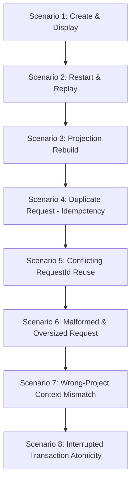

# P0-01 Vertical Slice Hardening & Verification Plan

**Specification:** [`docs/spec/p0/P0-01 — First vertical-slice contract.md`](file:///c:/Users/IronMan/Desktop/adham.si/docs/spec/p0/P0-01%20%E2%80%94%20First%20vertical-slice%20contract.md)  
**Governing Documents:** [`P0 — Implementation decisions & execution order.md`](file:///c:/Users/IronMan/Desktop/adham.si/docs/spec/p0/P0%20%E2%80%94%20Implementation%20decisions%20&%20execution%20order.md), [`P0-04`](file:///c:/Users/IronMan/Desktop/adham.si/docs/spec/p0/P0-04%20%E2%80%94%20Typed%20IPC,%20capabilities%20&%20frontend%20sync.md), [`AGENTS.md`](file:///c:/Users/IronMan/Desktop/adham.si/AGENTS.md)  
**Date:** 2026-10-07  
**Status:** **COMPLETED & VERIFIED**  

---

## 1. Objective & Scope

P0-06 successfully established the repository foundation, crates, toolchains, and dev servers.  
**P0-01 establishes the formal behavioral and security contract for the First Vertical Slice.**

The goal of this plan is to harden all domain command handlers in `adham-desktop-api`, implement missing negative validation guards (`REQUEST_ID_CONFLICT`, `VALIDATION_FAILED`, `CONTEXT_MISMATCH`), and author a dedicated integration test suite covering the **8 Required Scenarios** defined in P0-01 §8.

---

## 2. The 8 Required P0-01 Scenarios

1. **Scenario 1 (Create and Display):**
   - Create workspace → isolated project → session → submit message `"Hello Adham"`.
   - Assert 4 canonical events exist in their respective streams with monotonic sequences.
   - Assert conversation projection contains 1 user message.
2. **Scenario 2 (Restart and Replay):**
   - Close SQLite connection pool, reopen pool on the same database path.
   - Run health check, verify projection re-hydrates with identical message IDs, text, and timestamps.
3. **Scenario 3 (Projection Rebuild):**
   - Delete `conversation_messages` records.
   - Execute `admin_rebuild_projections`.
   - Verify deterministic reconstruction from canonical events and segregated `content_records`.
4. **Scenario 4 (Duplicate Request / Idempotency):**
   - Replay identical `RequestId` + payload.
   - Verify cached receipt is returned; no second event or projection row is written.
5. **Scenario 5 (Conflicting Request Reuse):**
   - Reuse existing `RequestId` with *different* message text.
   - Verify backend rejects with `REQUEST_ID_CONFLICT` and writes nothing.
6. **Scenario 6 (Malformed Request Validation):**
   - Submit empty/whitespace-only text or payload exceeding size limits (64KB).
   - Submit invalid `protocol_version` (!= 1).
   - Verify backend rejects with `VALIDATION_FAILED` / `INVALID_COMMAND_VERSION` without appending events.
7. **Scenario 7 (Wrong-Project Context Mismatch):**
   - Submit message for a session belonging to Project A under Project B's context.
   - Verify backend rejects with `CONTEXT_MISMATCH` and writes nothing.
8. **Scenario 8 (Interrupted Transaction Atomicity):**
   - Inject failure before commit during event append.
   - Verify transaction rollback: no partial content, no orphan events, no uncommitted receipts.

---

## 3. Implementation Tasks & Technical Design

### Task 1: Receipt Fingerprinting & Conflict Detection (`adham-event-log`)
- **File:** `crates/adham-event-log/src/sqlite/store.rs`
- **Changes:**
  - Update `check_receipt` to return a `ReceiptRecord { outcome_code: String, response_json: Vec<u8>, request_fingerprint: String }`.
  - When storing receipts, compute BLAKE3 hash of normalized payload as `request_fingerprint`.
  - Enables deterministic detection between an idempotent retry (same fingerprint) vs a conflict (different fingerprint -> `REQUEST_ID_CONFLICT`).

### Task 2: Handler Negative Validation & Relational Context Guards (`adham-desktop-api`)
- **Files:** `crates/adham-desktop-api/src/handlers/session.rs`, `workspace.rs`
- **Changes:**
  - Validate `protocol_version == 1` (reject with `INVALID_COMMAND_VERSION`).
  - Validate `env.payload.text.trim().is_empty()` and text length <= 65536 bytes (reject with `VALIDATION_FAILED`).
  - Validate relational integrity: verify `session_id` belongs to `project_id`, and `project_id` belongs to `workspace_id` (reject with `CONTEXT_MISMATCH`).
  - Compare incoming request fingerprint against existing receipt; if divergent, return `REQUEST_ID_CONFLICT`.

### Task 3: Comprehensive Integration Test Suite (`adham-desktop-api`)
- **File:** `crates/adham-desktop-api/tests/p0_01_scenarios.rs`
- **Scenarios Tested:**
  - `test_scenario_1_create_and_display`
  - `test_scenario_2_restart_and_replay`
  - `test_scenario_3_projection_rebuild`
  - `test_scenario_4_duplicate_request_idempotency`
  - `test_scenario_5_conflicting_request_reuse`
  - `test_scenario_6_malformed_request_validation`
  - `test_scenario_7_wrong_project_context_mismatch`
  - `test_scenario_8_interrupted_transaction_atomicity`

### Task 4: Verification, Linting & Evidence Documentation
- Run `cargo test --workspace` (verify 100% pass rate).
- Run `node scripts/check-file-size.mjs` (verify all files <300 lines).
- Run `pnpm format:check` and `pnpm lint`.
- Generate verification evidence report in `docs/reports/p0-01-test-evidence.md`.

---

## 4. Execution Checklists

- [x] **Step 1:** Implement receipt fingerprint comparison in `adham-event-log`.
- [x] **Step 2:** Add payload & relational validation guards in `adham-desktop-api` handlers.
- [x] **Step 3:** Implement the 8 scenario tests in `crates/adham-desktop-api/tests/` (`scenarios_1_to_4.rs`, `scenarios_5_to_8.rs`).
- [x] **Step 4:** Execute test suite and verify all scenarios pass.
- [x] **Step 5:** Verify file size policy (<300 lines) and run formatting/linter checks.
- [x] **Step 6:** Record results in `docs/reports/p0-01-test-evidence.md`.
