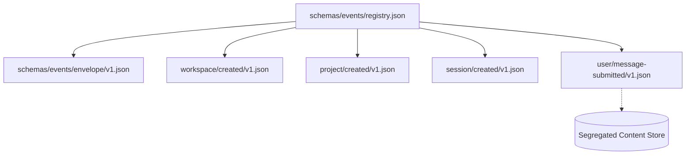

# P0-02 Canonical Event Taxonomy & Schema Plan

**Specification:** [`docs/spec/p0/P0-02 — Canonical event taxonomy & schema​.md`](file:///c:/Users/IronMan/Desktop/adham.si/docs/spec/p0/P0-02%20%E2%80%94%20Canonical%20event%20taxonomy%20&%20schema%E2%80%8B.md)  
**Governing Documents:** [`AGENTS.md`](file:///c:/Users/IronMan/Desktop/adham.si/AGENTS.md), [`P0 — Implementation decisions & execution order.md`](file:///c:/Users/IronMan/Desktop/adham.si/docs/spec/p0/P0%20%E2%80%94%20Implementation%20decisions%20&%20execution%20order.md), [`P0-01`](file:///c:/Users/IronMan/Desktop/adham.si/docs/spec/p0/P0-01%20%E2%80%94%20First%20vertical-slice%20contract.md)  
**Date:** 2026-10-07  
**Status:** **COMPLETED & VERIFIED**  

---

## 1. Objective & Scope

The canonical event log is Adham's durable source of truth. Commands express user intent; trusted application services enforce invariants and append immutable facts.  
**P0-02 defines the canonical event taxonomy, envelope structure, payload schemas, and integrity verification.**

The goal of this plan is to:
1. Establish the checked-in Event Registry and JSON Schema definitions:
   - `schemas/events/envelope/v1.json`
   - `schemas/events/workspace/created/v1.json`
   - `schemas/events/project/created/v1.json`
   - `schemas/events/session/created/v1.json`
   - `schemas/events/user/message-submitted/v1.json`
   - `schemas/events/registry.json`
2. Harden event payload definitions in `crates/adham-core-types/src/events.rs`:
   - Standardized event types: `workspace/created`, `project/created`, `session/created`, `user/message-submitted`.
   - Validate payload constraints (bounded non-empty names, permitted languages, storage kind).
3. Author a dedicated test suite verifying the 5 requirement categories defined in P0-02 §17:
   - **Schema:** Serde round-trip and validation invariants.
   - **Identity & Order:** Stream sequences and UUIDv7 invariants.
   - **Integrity:** BLAKE3 checksum framing and determinism across key iteration order.
   - **Compatibility:** Known v1 decode, unsupported future version rejection.
   - **Privacy:** Sensitive content segregation (raw user text absent from event payloads).
4. Run workspace validation checks and record verification evidence in `docs/reports/p0-02-test-evidence.md`.

---

## 2. Technical Architecture & Schemas

---

## 3. Implementation Tasks

### Task 1: Checked-in Schemas & Registry (`schemas/events/`)
- Create `schemas/events/registry.json` cataloging version 1 events.
- Create JSON schemas for envelope and the 4 domain payloads.

### Task 2: Core Types Hardening (`adham-core-types`)
- Define canonical type constants:
  - `WORKSPACE_CREATED_V1 = "workspace/created"`
  - `PROJECT_CREATED_V1 = "project/created"`
  - `SESSION_CREATED_V1 = "session/created"`
  - `USER_MESSAGE_SUBMITTED_V1 = "user/message-submitted"`
- Enforce domain validation constraints on payload creation.

### Task 3: Comprehensive Taxonomy Test Suite (`adham-core-types`)
- Author `crates/adham-core-types/tests/taxonomy_tests.rs`:
  - `test_serde_roundtrip_all_events`
  - `test_sensitive_content_segregation_invariant`
  - `test_unsupported_future_version_handling`
  - `test_schema_registry_consistency`
  - `test_canonical_checksum_determinism`

### Task 4: Verification & Evidence Documentation
- Run `cargo test --workspace`.
- Check file size policy: `node scripts/check-file-size.mjs` (<300 lines).
- Run formatting and linters (`pnpm format:check`, `pnpm lint`).
- File evidence report in `docs/reports/p0-02-test-evidence.md`.

---

## 4. Execution Checklist

- [x] **Step 1:** Create `schemas/events/` directory, JSON schemas, and `registry.json`.
- [x] **Step 2:** Harden event definitions and constants in `crates/adham-core-types/src/events.rs`.
- [x] **Step 3:** Implement taxonomy integration test suite in `crates/adham-core-types/tests/taxonomy_tests.rs`.
- [x] **Step 4:** Execute test suite and verify 100% pass rate.
- [x] **Step 5:** Verify file size policy (<300 lines) and formatting.
- [x] **Step 6:** Record results in `docs/reports/p0-02-test-evidence.md`.
