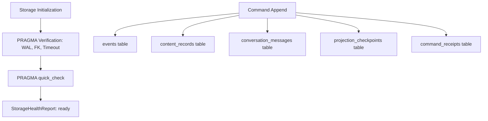

# P0-03 SQLite Storage, Content & Projections Plan

**Specification:** [`docs/spec/p0/P0-03 — SQLite event store, content & projections.md`](file:///c:/Users/IronMan/Desktop/adham.si/docs/spec/p0/P0-03%20%E2%80%94%20SQLite%20event%20store,%20content%20&%20projections.md)  
**Governing Documents:** [`AGENTS.md`](file:///c:/Users/IronMan/Desktop/adham.si/AGENTS.md), [`P0 — Implementation decisions & execution order.md`](file:///c:/Users/IronMan/Desktop/adham.si/docs/spec/p0/P0%20%E2%80%94%20Implementation%20decisions%20&%20execution%20order.md), [`P0-02`](file:///c:/Users/IronMan/Desktop/adham.si/docs/spec/p0/P0-02%20%E2%80%94%20Canonical%20event%20taxonomy%20&%20schema%E2%80%8B.md)  
**Date:** 2026-10-07  
**Status:** **COMPLETED**

---

## 1. Objective & Scope

P0-03 establishes SQLite as Adham's durable journal: immutable structural events, separately protected private content, atomic idempotency receipts, and rebuildable projections.  
**A committed command is either completely visible or not visible at all.**

The goal of this plan is to:
1. Implement runtime Storage Health Verification (`StorageHealthReport`) checking effective PRAGMA settings:
   - `journal_mode = WAL`
   - `foreign_keys = ON`
   - `busy_timeout >= 5000ms`
   - `PRAGMA quick_check = ok`
2. Implement Projection Checkpoint Tracking:
   - Synchronously advance `projection_checkpoints` when conversation projection rows are inserted.
   - Provide checkpoint query and validation APIs in `adham-projections`.
3. Wire storage health into `handle_get_storage_status` in `adham-desktop-api`.
4. Implement dedicated P0-03 storage contract integration tests in `crates/adham-event-log/tests/storage_contract_tests.rs`.
5. Verify file size policy (<300 lines) and record evidence in `docs/reports/p0-03-test-evidence.md`.

---

## 2. Technical Architecture & Component Flow

---

## 3. Implementation Tasks

### Task 1: Storage Health Verification (`adham-event-log`)
- **File:** `crates/adham-event-log/src/sqlite/health.rs`
- Inspect live PRAGMA values on the pool: `PRAGMA journal_mode`, `PRAGMA foreign_keys`, `PRAGMA busy_timeout`, and `PRAGMA quick_check`.
- Return `StorageHealthReport { is_healthy: bool, journal_mode: String, foreign_keys: bool, busy_timeout_ms: u32, quick_check_ok: bool }`.

### Task 2: Projection Checkpoint Tracking (`adham-projections` & `adham-desktop-api`)
- **Files:** `crates/adham-projections/src/conversation.rs`, `crates/adham-desktop-api/src/handlers/message.rs`
- Update `projection_checkpoints` on every synchronous message projection insert.
- Provide `ConversationProjection::get_checkpoint(pool)` to inspect current projection position.

### Task 3: Desktop API Storage Status Integration (`adham-desktop-api`)
- **File:** `crates/adham-desktop-api/src/handlers/system.rs`
- Connect `handle_get_storage_status` to `verify_storage_health`.

### Task 4: Storage Contract Test Suite (`adham-event-log`)
- **File:** `crates/adham-event-log/tests/storage_contract_tests.rs`
- Test live health check verification.
- Test projection checkpoint advancement and consistency.
- Test atomic transaction rollback guarantees.

### Task 5: Verification & Evidence Documentation
- Run `cargo test --workspace`.
- Check file size policy: `node scripts/check-file-size.mjs` (<300 lines).
- Run formatting and linters (`pnpm format:check`, `pnpm lint`).
- File evidence report in `docs/reports/p0-03-test-evidence.md`.

---

## 4. Execution Checklist

- [x] **Step 1:** Implement storage health verification in `crates/adham-event-log/src/sqlite/health.rs`.
- [x] **Step 2:** Add checkpoint tracking to message handler and projection store.
- [x] **Step 3:** Wire storage health verification into `handle_get_storage_status`.
- [x] **Step 4:** Implement storage contract integration tests in `crates/adham-event-log/tests/storage_contract_tests.rs`.
- [x] **Step 5:** Verify file size policy (<300 lines) and formatting.
- [x] **Step 6:** Record results in `docs/reports/p0-03-test-evidence.md`.
