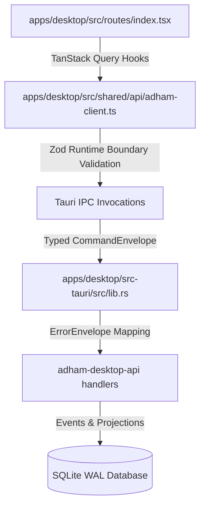

# P0-04 Typed IPC, Capabilities & Frontend Sync Plan

**Specification:** [`docs/spec/p0/P0-04 — Typed IPC, capabilities & frontend sync.md`](file:///c:/Users/IronMan/Desktop/adham.si/docs/spec/p0/P0-04%20%E2%80%94%20Typed%20IPC,%20capabilities%20&%20frontend%20sync.md)  
**Governing Documents:** [`AGENTS.md`](file:///c:/Users/IronMan/Desktop/adham.si/AGENTS.md), [`P0 — Implementation decisions & execution order.md`](file:///c:/Users/IronMan/Desktop/adham.si/docs/spec/p0/P0%20%E2%80%94%20Implementation%20decisions%20&%20execution%20order.md), [`P0-01`](file:///c:/Users/IronMan/Desktop/adham.si/docs/spec/p0/P0-01%20%E2%80%94%20First%20vertical-slice%20contract.md)  
**Date:** 2026-10-07  
**Status:** **COMPLETED & VERIFIED**  

---

## 1. Objective & Scope

P0-01 hardened the domain engine and proved the 8 required vertical-slice scenarios at the Rust crate boundary.  
**P0-04 establishes the typed, abuse-resistant IPC bridge connecting the React desktop frontend to the Rust backend.**

The goal of this plan is to:
1. Harden `AdhamApiClient` with runtime boundary validation using bounded Zod schemas (detecting contract drift at the wire boundary).
2. Establish canonical TanStack Query keys as specified in P0-04 §12 (`bootstrap`, `conversation`, `workspace`, `projects`).
3. Connect the live running Desktop UI (`apps/desktop/src/routes/index.tsx`) to the authoritative backend:
   - Automatically initialize the default workspace, project, and session when `!bootstrap.isInitialized`.
   - Submit real messages through `adhamClient.submitMessage(...)`.
   - Fetch real conversation projection messages through `adhamClient.getConversation(...)`.
4. Implement typed public error envelopes (`ErrorEnvelope`) in the Tauri command adapter (`apps/desktop/src-tauri/src/lib.rs`) ensuring no internal traces or SQL errors leak across the boundary.
5. Author automated tests verifying the client contract and boundary validation.
6. Verify file size policy (<300 lines) and record evidence in `docs/reports/p0-04-test-evidence.md`.

---

## 2. Technical Architecture & Component Flow



---

## 3. Implementation Tasks

### Task 1: Bounded Zod Schemas at the Client Boundary (`apps/desktop`)
- **File:** `apps/desktop/src/shared/api/adham-client.ts`
- Implement lightweight Zod schemas validating returned shapes (`BootstrapStateSchema`, `SubmittedMessageSchema`, `ConversationPageSchema`, `ErrorEnvelopeSchema`).
- Catch contract drift before passing corrupt or unexpectedly shaped objects to UI components.

### Task 2: Standardized TanStack Query Keys & Cache Management
- **File:** `apps/desktop/src/shared/api/query-keys.ts`
- Implement canonical query key factory:
  ```ts
  export const queryKeys = {
    bootstrap: ['bootstrap'] as const,
    storageStatus: ['storage-status'] as const,
    workspace: (workspaceId: string) => ['workspace', workspaceId] as const,
    projects: (workspaceId: string) => ['projects', workspaceId] as const,
    conversation: (workspaceId: string, projectId: string, sessionId: string) =>
      ['conversation', workspaceId, projectId, sessionId] as const,
  };
  ```

### Task 3: Typed Public Error Envelope Mapping (`src-tauri`)
- **File:** `apps/desktop/src-tauri/src/lib.rs`
- Return typed `Result<T, ErrorEnvelope>` from commands instead of raw strings.
- Map domain error strings (`INVALID_COMMAND_VERSION`, `VALIDATION_FAILED`, `CONTEXT_MISMATCH`, `REQUEST_ID_CONFLICT`) into structured public error codes with localized `message_key` and `retryable` flags.

### Task 4: Authoritative Frontend Sync in Desktop UI (`routes/index.tsx`)
- **File:** `apps/desktop/src/routes/index.tsx`
- On bootstrap check: if `!bootstrap.isInitialized`, trigger idempotent onboarding sequence to create the initial personal workspace, project, and session.
- Wire message composition to mutate real backend state and invalidate `queryKeys.conversation`.
- Display live messages from the SQLite synchronous projection.

### Task 5: Automated Verification & Evidence Documentation
- Contract drift check: `cargo xtask contracts --check`.
- Client unit tests: `pnpm --filter @adham/desktop test`.
- File size policy: `node scripts/check-file-size.mjs` (<300 lines).
- Formatter & Linter: `pnpm format:check` and `pnpm lint`.
- Author `docs/reports/p0-04-test-evidence.md`.

---

## 4. Execution Checklist

- [x] **Step 1:** Define canonical query keys in `apps/desktop/src/shared/api/query-keys.ts`.
- [x] **Step 2:** Harden `apps/desktop/src/shared/api/adham-client.ts` with Zod boundary schemas.
- [x] **Step 3:** Update `apps/desktop/src-tauri/src/lib.rs` to map typed `ErrorEnvelope`.
- [x] **Step 4:** Wire desktop route in `apps/desktop/src/routes/index.tsx` to live backend state with auto-initialization.
- [x] **Step 5:** Verify contracts, file-size policy (<300 lines), formatting, and linters.
- [x] **Step 6:** Document results in `docs/reports/p0-04-test-evidence.md`.
