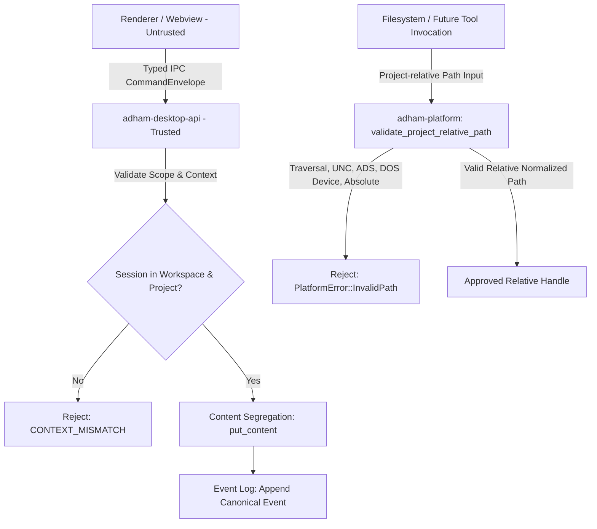

# P0-05 Project-Isolation Threat Model Plan

**Specification:** [`docs/spec/p0/P0-05 — Project-isolation threat model.md`](file:///c:/Users/IronMan/Desktop/adham.si/docs/spec/p0/P0-05%20%E2%80%94%20Project-isolation%20threat%20model.md)  
**Governing Documents:** [`AGENTS.md`](file:///c:/Users/IronMan/Desktop/adham.si/AGENTS.md), [`P0 — Implementation decisions & execution order.md`](file:///c:/Users/IronMan/Desktop/adham.si/docs/spec/p0/P0%20%E2%80%94%20Implementation%20decisions%20&%20execution%20order.md)  
**Date:** 2026-10-07  
**Status:** **COMPLETED**

---

## 1. Objective & Scope

P0-05 establishes the primary security boundary of Adham: the project.  
**Adham’s primary security boundary is the project—not the visible window, current route, model, provider, or process working directory. Every access must be derived from an immutable execution identity and a trusted capability grant.**

The goal of this milestone is to implement and verify the security invariants and threat mitigation layers specified in P0-05:
1. **Path-Resolution & Traversal Hardening (`adham-platform`):**
   - Implement `validate_project_relative_path` enforcing strict project-relative path boundaries.
   - Reject traversal sequences (`..`), absolute paths, drive-relative paths, device/namespace paths (`\\?\`, `\\.\`, UNC shares).
   - Reject Windows Alternate Data Streams (ADS) (`:` syntax).
   - Reject Windows reserved DOS device names (`CON`, `PRN`, `AUX`, `NUL`, `COM1..9`, `LPT1..9`).
   - Reject trailing dots and spaces, NUL characters, and unsupported encodings.
2. **Immutable Execution Identity & Context Scoping:**
   - Verify context relationship enforcement (`CONTEXT_MISMATCH` when session does not belong to specified workspace/project).
   - Backend-assigned actor identities (`ActorId`, `ActorKind::LocalHuman`).
   - Renderer cannot supply raw paths, SQL, or arbitrary events.
3. **Sensitive-Content Segregation & Redaction:**
   - Events and public logs strictly omit user text/prompt content.
   - Public errors contain no database paths, SQL statements, or private data.
4. **Integration Test Suite (`adham-platform/tests/isolation_tests.rs`):**
   - Comprehensive test suite covering the P0-05 Security Test Matrix.
5. **Quality & Evidence:**
   - Adhere strictly to file size policy (<300 lines).
   - Full workspace tests passing.
   - Record results in `docs/reports/p0-05-test-evidence.md`.

---

## 2. Technical Architecture & Trust Boundaries

---

## 3. Implementation Tasks

### Task 1: Path Resolution & Validation (`adham-platform`)
- **File:** `crates/adham-platform/src/isolation.rs`
- Implement `validate_project_relative_path(path: &str) -> Result<PathBuf, PlatformError>` with complete validation rules:
  - Empty or NUL-containing path rejection.
  - Absolute, UNC, verbatim (`\\?\`), and drive-relative path rejection.
  - Lexical normalization and `..` parent traversal rejection.
  - Windows Alternate Data Stream (ADS) rejection.
  - Windows reserved DOS device names rejection (`CON`, `PRN`, `AUX`, `NUL`, `COM1..9`, `LPT1..9`).
  - Trailing dots and spaces rejection.
- Export in `crates/adham-platform/src/lib.rs`.

### Task 2: Isolation Test Suite (`adham-platform/tests/isolation_tests.rs`)
- Implement comprehensive tests covering all attack vectors:
  - Path traversal (`../foo`, `a/../../b`, `..`)
  - Absolute paths (`/etc/passwd`, `C:\Windows\System32`, `D:foo`)
  - UNC and namespace device paths (`\\?\C:\foo`, `\\server\share`, `\\.\COM1`)
  - Alternate Data Streams (`data.txt:secret`, `foo:$DATA`)
  - Windows reserved DOS devices (`con`, `PRN.txt`, `aux.dat`, `NUL`, `com1.json`)
  - Trailing dots and spaces (`foo. `, `bar/baz.`)
  - NUL byte injection (`foo\0bar`)
  - Valid relative paths (`src/main.rs`, `docs/spec/p0.md`, `nested/deep/file.json`)

### Task 3: Workspace Verification & Security Matrix Review
- Run `cargo test --workspace`.
- Check file size policy: `node scripts/check-file-size.mjs` (<300 lines).
- Format and lint checks: `cargo fmt --check`, `pnpm format:check`, `pnpm lint`.

### Task 4: Documentation & Evidence
- Document results in `docs/reports/p0-05-test-evidence.md`.
- Update plan status to completed.

---

## 4. Execution Checklist

- [x] **Step 1:** Implement `validate_project_relative_path` in `crates/adham-platform/src/isolation.rs`.
- [x] **Step 2:** Export isolation APIs in `crates/adham-platform/src/lib.rs`.
- [x] **Step 3:** Implement integration tests in `crates/adham-platform/tests/isolation_tests.rs`.
- [x] **Step 4:** Verify all workspace tests and file size policy (<300 lines).
- [x] **Step 5:** Record evidence in `docs/reports/p0-05-test-evidence.md`.
