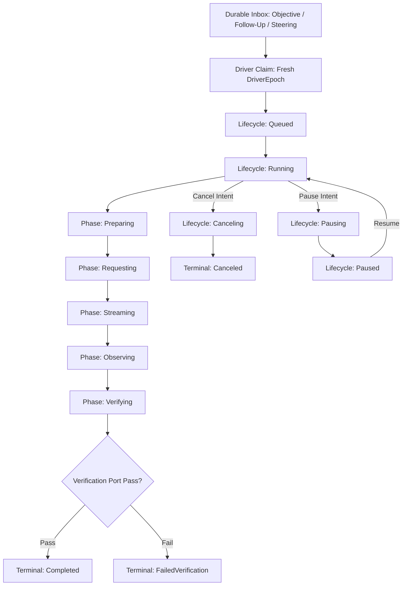

# P0-07 Agent Runtime State Machine Plan

**Specification:** [`docs/spec/p0/P0-07 — Agent runtime state machine.md`](file:///c:/Users/IronMan/Desktop/adham.si/docs/spec/p0/P0-07%20%E2%80%94%20Agent%20runtime%20state%20machine.md)  
**Governing Documents:** [`AGENTS.md`](file:///c:/Users/IronMan/Desktop/adham.si/AGENTS.md), [`P0 — Implementation decisions & execution order.md`](file:///c:/Users/IronMan/Desktop/adham.si/docs/spec/p0/P0%20%E2%80%94%20Implementation%20decisions%20&%20execution%20order.md)  
**Date:** 2026-10-07  
**Status:** **COMPLETED**

---

## 1. Objective & Scope

P0-07 defines Adham's single-agent execution kernel:
- **Runtime owns execution state:** The runtime—not the model—validates and commits every state transition.
- **Orthogonal state model:** Distinct separation between lifecycle (`queued`, `running`, `pausing`, `paused`, `canceling`, `recovering`, `blocked`, `terminal`), running phase (`preparing`, `requesting`, `streaming`, `observing`, `verifying`), and control intent (`cancel > pause > ordinary advancement`).
- **Durable inbox & instruction queue:** Typed items (`objective`, `follow-up`, `steering`), FIFO ordering, steering precedence, dispositions (`queued`, `claimed`, `applied`, `canceled`).
- **Turn, step, attempt hierarchy:** Explicit identities (`TaskId`, `AgentId`, `RunId`, `TurnId`, `StepId`, `AttemptId`, `OperationId`, `DriverEpoch`).
- **Resource budgets:** Enforced ceilings on turns, steps, attempts, durations, and output bytes.
- **Verification-gated completion:** The model produces a completion proposal; a trusted verification port determines completion (`completed`, `completed-with-warnings`, `failed-verification`, `blocked`).

---

## 2. Technical Architecture & Component Flow

---

## 3. Implementation Tasks

### Task 1: Create `adham-runtime` Crate & Workspace Registration
- Register `crates/adham-runtime` in root `Cargo.toml`.
- Create `crates/adham-runtime/Cargo.toml`.

### Task 2: Domain Layer (`crates/adham-runtime/src/domain/`)
- `identity.rs`: Typed domain IDs (`TaskId`, `AgentId`, `RunId`, `TurnId`, `StepId`, `AttemptId`, `OperationId`, `InboxItemId`, `CheckpointId`, `DriverEpoch`, `ExecutionIdentity`).
- `run.rs`: `RunLifecycle`, `RunPhase`, `TerminalOutcome`, `BlockReason`, `RunState`.
- `turn.rs`: `TurnLifecycle`, `TurnState`.
- `step.rs`: `StepKind`, `StepLifecycle`, `StepState`.
- `attempt.rs`: `AttemptLifecycle`, `AttemptState`.
- `inbox.rs`: `InboxItemType`, `InboxDisposition`, `InboxItem`.
- `budget.rs`: `RunBudget`, `BudgetUsage`.
- `transition.rs`: Deterministic pure reducer `reduce_run`.

### Task 3: Ports Layer (`crates/adham-runtime/src/ports/`)
- `model.rs`: `ModelPort` trait and deterministic `FakeModelAdapter`.
- `verification.rs`: `VerificationPort` trait, `CompletionContract`, `VerificationVerdict`.
- `clock.rs`: `Clock` trait and simulated/system clocks.

### Task 4: Application Layer (`crates/adham-runtime/src/application/`)
- `driver.rs`: Single-agent run execution driver coordinating phase progression, attempt execution, cancellation/pause checks, and verification.
- `checkpoint.rs`: State snapshotting and restore helpers.

### Task 5: Comprehensive Test Suite (`crates/adham-runtime/tests/`)
- `transition_tests.rs`: Legal/forbidden state transitions, terminal immutability, precedence.
- `inbox_tests.rs`: Inbox item prioritization and claiming.
- `budget_tests.rs`: Budget limits and exhaustion blocking.
- `driver_tests.rs`: Complete lifecycle execution with fake model and verifier adapters.

### Task 6: Verification & Evidence
- Run `cargo test --workspace`.
- Audit file sizes (<300 lines via `node scripts/check-file-size.mjs`).
- Verify linters and formatters.
- Document in `docs/reports/p0-07-test-evidence.md`.

---

## 4. Execution Checklist

- [x] **Step 1:** Create `crates/adham-runtime` and register in workspace.
- [x] **Step 2:** Implement domain identities, state machines, and pure reducer.
- [x] **Step 3:** Implement model, verification, and clock ports.
- [x] **Step 4:** Implement execution driver and checkpointing.
- [x] **Step 5:** Implement comprehensive integration tests in `crates/adham-runtime/tests/`.
- [x] **Step 6:** Run workspace verification, file-size audit, and document evidence.
