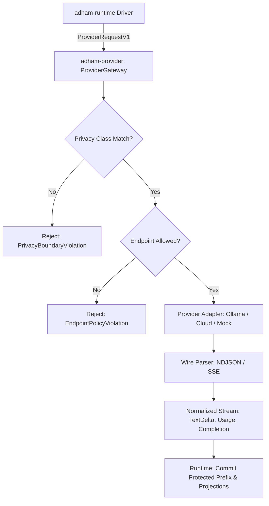

# P0-08 Provider Gateway & Normalized Stream Contract Plan

**Specification:** [`docs/spec/p0/P0-08 — Provider gateway and normalized stream contract.md`](file:///c:/Users/IronMan/Desktop/adham.si/docs/spec/p0/P0-08%20%E2%80%94%20Provider%20gateway%20and%20normalized%20stream%20contract.md)  
**Governing Documents:** [`AGENTS.md`](file:///c:/Users/IronMan/Desktop/adham.si/AGENTS.md), [`P0 — Implementation decisions & execution order.md`](file:///c:/Users/IronMan/Desktop/adham.si/docs/spec/p0/P0%20%E2%80%94%20Implementation%20decisions%20&%20execution%20order.md)  
**Date:** 2026-10-07  
**Status:** **COMPLETED**  

---

## 1. Objective & Scope

P0-08 establishes Adham's provider-neutral gateway and streaming contract:
- **Providers supply output, not authority:** Requests are bound to immutable execution identities, approved accounts, and verified endpoints.
- **Privacy classification:** Explicit separation of `LocalOnly`, `CloudConfidential`, and `CloudStandard` inference. Local-to-cloud fallback cannot happen implicitly.
- **Normalized streaming contract:** Uniform `NormalizedStreamEvent` stream across all providers (`StreamStarted`, `TextDelta`, `ThinkingDelta`, `ToolCallProposal`, `StreamProgress`, `StreamCompleted`).
- **Ollama Local & protocol adapters:** Streaming NDJSON parser for Ollama `/api/chat` and deterministic mock protocol fixtures.
- **Sanitized errors & credential boundaries:** Zero raw credentials, bearer tokens, or sensitive context exposed in errors or diagnostics.

---

## 2. Technical Architecture

---

## 3. Implementation Tasks

### Task 1: Create `adham-provider` Crate & Workspace Setup
- Add `crates/adham-provider` to `Cargo.toml`.
- Configure dependencies: `adham-core-types`, `adham-runtime`, `serde`, `serde_json`, `thiserror`, `tokio`.

### Task 2: Domain Layer (`crates/adham-provider/src/domain/`)
- `account.rs`: `ProviderAccountId`, `ProviderKind`, `PrivacyClass`, `ProviderAccountDescriptor`.
- `endpoint.rs`: `EndpointId`, `EndpointDescriptor`, `ServiceKind`, URL & loopback validation.
- `model.rs`: `ModelDescriptor`, `ModelCapabilities`, `ModelSelectionSnapshot`.
- `request.rs`: `ProviderRequestV1`, `ChatMessage`, `MessageRole`.
- `stream.rs`: `NormalizedStreamEvent`, `StreamUsage`, `StreamCompletionOutcome`.
- `error.rs`: Sanitized `ProviderError`.

### Task 3: Adapters Layer (`crates/adham-provider/src/adapters/`)
- `ollama.rs`: NDJSON stream parser for Ollama `/api/chat` streaming protocol.
- `mock.rs`: Deterministic protocol test adapter for simulated streaming, errors, and cancellation.

### Task 4: Gateway Layer (`crates/adham-provider/src/gateway/`)
- `gateway.rs`: `ProviderGateway` enforcing endpoint/privacy policies and streaming normalized events.
- Implement `adham_runtime::ports::model::ModelPort` for gateway execution.

### Task 5: Integration Test Suite (`crates/adham-provider/tests/`)
- `protocol_tests.rs`: Ollama NDJSON stream parsing and usage metrics.
- `privacy_boundary_tests.rs`: Enforcement of `LocalOnly` vs cloud policies.
- `stream_normalization_tests.rs`: Delta chunk aggregation and completion outcomes.
- `gateway_runtime_tests.rs`: End-to-end gateway execution with `AgentDriver`.

### Task 6: Verification & Evidence
- Workspace `cargo test --workspace` passes 100%.
- File size check (`node scripts/check-file-size.mjs` <300 lines).
- Record results in `docs/reports/p0-08-test-evidence.md`.

---

## 4. Execution Checklist

- [x] **Step 1:** Create `crates/adham-provider` and register in workspace.
- [x] **Step 2:** Implement domain types (account, endpoint, model, request, stream, error).
- [x] **Step 3:** Implement Ollama and mock stream adapters.
- [x] **Step 4:** Implement `ProviderGateway` and `ModelPort` bridge.
- [x] **Step 5:** Implement comprehensive integration tests in `crates/adham-provider/tests/`.
- [x] **Step 6:** Run workspace verification, file-size audit, and document evidence.
