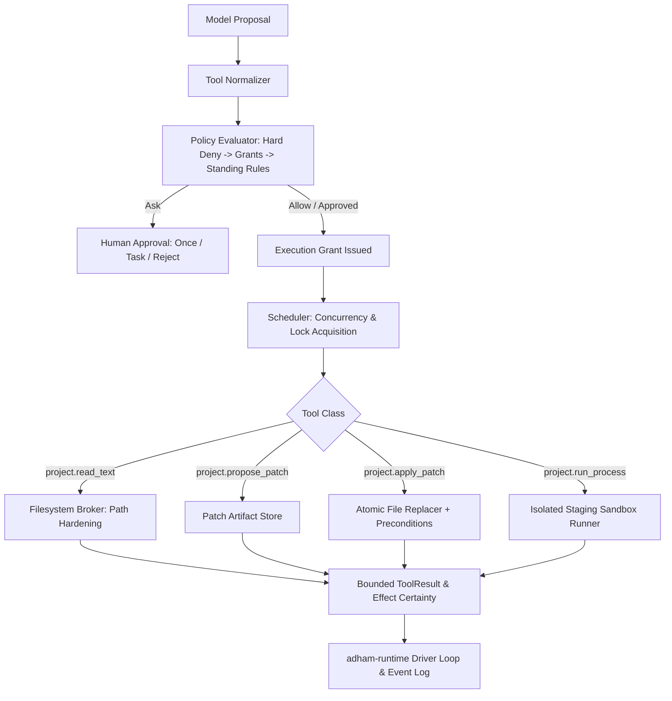

# P0-09 Tools, Policy, and Sandbox Execution Contract Plan

**Specification:** [`docs/spec/p0/P0-09 — Tools, policy, and sandbox execution contract.md`](file:///c:/Users/IronMan/Desktop/adham.si/docs/spec/p0/P0-09%20%E2%80%94%20Tools,%20policy,%20and%20sandbox%20execution%20contract.md)  
**Governing Documents:** [`AGENTS.md`](file:///c:/Users/IronMan/Desktop/adham.si/AGENTS.md), [`P0 — Implementation decisions & execution order.md`](file:///c:/Users/IronMan/Desktop/adham.si/docs/spec/p0/P0%20%E2%80%94%20Implementation%20decisions%20&%20execution%20order.md), [`P0-05 — Project-isolation threat model.md`](file:///c:/Users/IronMan/Desktop/adham.si/docs/spec/p0/P0-05%20%E2%80%94%20Project-isolation%20threat%20model.md)  
**Date:** 2026-10-07  
**Status:** **COMPLETED**  

---

## 1. Objective & Non-Negotiable Invariants

P0-09 establishes Adham's governed tool execution, policy evaluation, and sandbox subsystem (`adham-tools`):
- **Models propose, they never authorize:** Tool proposals are normalized, evaluated against policy, granted scoped capabilities, and executed via trusted brokers.
- **First tool set:**
  1. `project.read_text`: Bounded brokered read of an approved project-relative file (up to 256 KiB excerpt, max 8 MiB file).
  2. `project.propose_patch`: Protected patch artifact creation without modifying project files (up to 1 MiB, max 20 files).
  3. `project.apply_patch`: Brokered mutation with identity/content precondition verification and atomic per-file replacement.
  4. `project.run_process`: Constrained process execution in an isolated staging workspace without ambient host credentials or shell interpolation.
- **Policy decisions:** `Allow`, `Ask` (exact approval needed), `Deny` (prohibited), `Block` (containment/identity unavailable).
- **Approval scopes:** `Once` (exact operation), `Task` (bounded rule for run), `StandingRule`, `Reject`.
- **Effect certainty:** `NotStarted`, `Active`, `Settled`, `Partial`, `Unknown`.
- **Zero shell strings:** Executables and arguments must be structured `Vec<String>` vectors—no cmd.exe, sh, or powershell interpolation.

---

## 2. Technical Architecture

---

## 3. Implementation Tasks

### Task 1: Create `adham-tools` Crate & Workspace Setup
- Add `crates/adham-tools` to `Cargo.toml`.
- Dependencies: `adham-core-types`, `adham-platform`, `adham-runtime`, `serde`, `serde_json`, `thiserror`, `tokio`, `blake3`, `uuid`.

### Task 2: Domain Layer (`crates/adham-tools/src/domain/`)
- `definition.rs`: `ToolDefinition`, `ToolCategory`, `SchedulingClass`, `ResourceLimitSpec`.
- `proposal.rs`: `ToolProposal`, `ToolProposalId`, argument normalization & validation.
- `policy.rs`: `PolicyDecision`, `PolicyRule`, `PolicyScope`, `ReasonCode`.
- `approval.rs`: `ApprovalRequest`, `ApprovalDecision`, `ApprovalScope`, `ApprovalId`.
- `grant.rs`: `ExecutionGrant`, `RootGrant`, `BinaryGrant`, capability scopes.
- `result.rs`: `ToolResult`, `EffectCertainty`, `ToolOutcome`, `ToolLimits`.

### Task 3: Filesystem Broker & Patching (`crates/adham-tools/src/broker/`)
- `read.rs`: Safe brokered reader enforcing `adham-platform` path isolation and 256 KiB / 8 MiB limits.
- `patch.rs`: `PatchArtifact`, content diff calculation, precondition checks (content hash / target existence), atomic file replacement, and rollback/settlement journal.

### Task 4: Sandbox & Staging Execution (`crates/adham-tools/src/sandbox/`)
- `profile.rs`: `SandboxProfile`, network policy (Strict Deny), environment allowlist (stripping API keys, SSH, credentials).
- `staging.rs`: Isolated snapshot staging creator copying only authorized project files.
- `runner.rs`: Structured process executor (`Vec<String>` argv vector) with wall-time timeouts and output capture limits (8 MiB total, 16 KiB model excerpt).

### Task 5: Scheduler & Runtime Integration (`crates/adham-tools/src/scheduler/`)
- `scheduler.rs`: Concurrency bounds (max 4 reads, 1 process, 1 live mutation), queue fairness, and lock management.
- Implement `adham_runtime::ports::tool::ToolPort` linking `adham-tools` directly to `AgentDriver`.

### Task 6: Test Suite & Security Validation (`crates/adham-tools/tests/`)
- `policy_tests.rs`: Hard deny beats approval, scope narrowing, expired/revoked grant handling.
- `broker_tests.rs`: Path traversal rejection, ADS/DOS device protection, bounded read enforcement.
- `patch_tests.rs`: Precondition mismatch abort, atomic file replacement, partial failure tracking.
- `sandbox_tests.rs`: Shell injection immunity, environment stripping, timeout containment.
- `scheduler_tests.rs`: Concurrency limits and lock contention safety.

### Task 7: Verification & Evidence
- Workspace tests pass 100% (`cargo test --workspace`).
- File size audit (`node scripts/check-file-size.mjs` strictly <300 lines).
- Record evidence in `docs/reports/p0-09-test-evidence.md`.

---

## 4. Execution Checklist

- [x] **Step 1:** Create `crates/adham-tools` and workspace registration.
- [x] **Step 2:** Implement domain entities (definition, proposal, policy, approval, grant, result).
- [x] **Step 3:** Implement filesystem broker and patch engine with strict precondition verification.
- [x] **Step 4:** Implement sandbox staging and structured process runner.
- [x] **Step 5:** Implement scheduler and `ToolPort` bridge for `adham-runtime`.
- [x] **Step 6:** Implement comprehensive security and failure test suite.
- [x] **Step 7:** Run workspace verification, file-size audit, and record evidence report.
