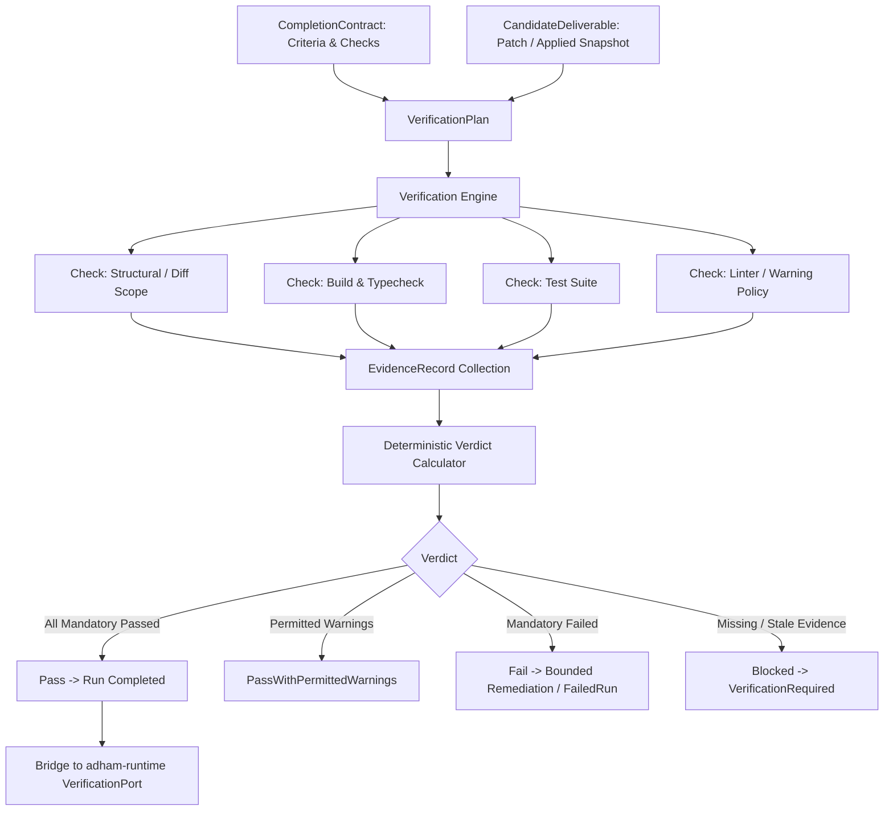

# P0-10 Verification Gate & Evidence-Backed Completion Contract Plan

**Specification:** [`docs/spec/p0/P0-10 — Verification gate and evidence-backed completion contract.md`](file:///c:/Users/IronMan/Desktop/adham.si/docs/spec/p0/P0-10%20%E2%80%94%20Verification%20gate%20and%20evidence-backed%20completion%20contract.md)  
**Governing Documents:** [`AGENTS.md`](file:///c:/Users/IronMan/Desktop/adham.si/AGENTS.md), [`P0 — Implementation decisions & execution order.md`](file:///c:/Users/IronMan/Desktop/adham.si/docs/spec/p0/P0%20%E2%80%94%20Implementation%20decisions%20&%20execution%20order.md), [`P0-07 — Agent runtime state machine.md`](file:///c:/Users/IronMan/Desktop/adham.si/docs/spec/p0/P0-07%20%E2%80%94%20Agent%20runtime%20state%20machine.md)  
**Date:** 2026-10-07  
**Status:** **COMPLETED**  

---

## 1. Objective & Non-Negotiable Invariants

P0-10 establishes Adham's trusted verification gate subsystem (`adham-verify`):
- **Completion is a trusted determination, not a model assertion:** A model cannot declare itself done, nor can exit code zero alone satisfy a task contract.
- **Delivery modes:**
  1. `ProposalOnly`: Verified candidate patch against baseline without applying to user workspace.
  2. `ApplyAndVerify`: Brokered applied changes verified against post-application observed state.
  3. `ArtifactOnly`: Structural validation of output artifacts.
- **Check result states:** `Passed`, `Failed`, `Blocked`, `Skipped`, `Stale`, `Invalid`, `NotApplicable`.
- **Deterministic verdict calculation:**
  - `Pass`: Every mandatory criterion satisfied with fresh, untampered evidence; no unresolved warnings.
  - `PassWithPermittedWarnings`: Every mandatory criterion satisfied; only explicitly permitted optional warnings exist.
  - `Fail`: Valid applicable evidence contradicts at least one mandatory requirement.
  - `Blocked`: Mandatory evidence is missing, skipped, stale, invalid, or security prerequisites were unfulfilled.
- **Non-negotiable invariants:**
  - Hard security/policy gates can never be waived.
  - Skipped mandatory checks block completion—they are never treated as passes.
  - Evidence binds to immutable candidate deliverable hash, task ID, and contract revision.

---

## 2. Technical Architecture

---

## 3. Implementation Tasks

### Task 1: Create `adham-verify` Crate & Workspace Setup
- Add `crates/adham-verify` to root `Cargo.toml`.
- Dependencies: `adham-core-types`, `adham-runtime`, `adham-tools`, `serde`, `serde_json`, `thiserror`, `uuid`, `blake3`, `tokio`.

### Task 2: Domain Layer (`crates/adham-verify/src/domain/`)
- `contract.rs`: `CompletionContract`, `CompletionContractId`, `DeliveryMode`, `AcceptanceCriterion`.
- `deliverable.rs`: `CandidateDeliverable`, `DeliverableKind`, fingerprinting and snapshot hashing.
- `check.rs`: `CheckDefinition`, `CheckId`, `CheckKind`, `CheckResultState`, `CheckExecution`.
- `evidence.rs`: `EvidenceRecord`, `EvidenceId`, provenance metadata, freshness timestamps.
- `finding.rs`: `Finding`, `FindingSeverity` (`Error`, `Warning`, `Info`), warning waiver policies.
- `verdict.rs`: `VerificationVerdict` (`Pass`, `PassWithPermittedWarnings`, `Fail`, `Blocked`), deterministic evaluation rules.

### Task 3: Engine Layer (`crates/adham-verify/src/engine/`)
- `evaluator.rs`: Pure deterministic verdict evaluator given contract, deliverable, and evidence records.
- `plan.rs`: `VerificationPlan` builder and dependency graph of checks.

### Task 4: Runtime Bridge (`crates/adham-verify/src/bridge/`)
- Implement `adham_runtime::ports::verification::VerificationPort` connecting `adham-verify` directly to `AgentDriver`.

### Task 5: Comprehensive Test Suite (`crates/adham-verify/tests/`)
- `verdict_tests.rs`: Deterministic verdict evaluation (all pass, mandatory fail, permitted warning, blocked on missing/skipped evidence).
- `contract_tests.rs`: Delivery mode validation and acceptance criteria mapping.
- `evidence_tests.rs`: Provenance verification, stale evidence invalidation, fingerprint mismatches.
- `runtime_bridge_tests.rs`: End-to-end driver turn verification with `adham-verify`.

### Task 6: Verification & Evidence
- Workspace verification (`cargo test --workspace`).
- File size audit (`node scripts/check-file-size.mjs` strictly <300 lines).
- Record evidence report in `docs/reports/p0-10-test-evidence.md`.

---

## 4. Execution Checklist

- [x] **Step 1:** Create `crates/adham-verify` and workspace registration.
- [x] **Step 2:** Implement domain entities (contract, deliverable, check, evidence, finding, verdict).
- [x] **Step 3:** Implement verdict evaluator and verification plan engine.
- [x] **Step 4:** Implement `VerificationPort` bridge for `adham-runtime`.
- [x] **Step 5:** Implement comprehensive integration tests.
- [x] **Step 6:** Run workspace verification, file-size audit, and record evidence report.
