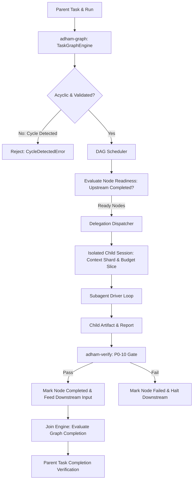

# P0-11 Task Graph & Isolated Subagent Execution Contract Plan

**Specification:** [`docs/spec/p0/P0-11 — Task graph and isolated subagent execution contract.md`](file:///c:/Users/IronMan/Desktop/adham.si/docs/spec/p0/P0-11%20%E2%80%94%20Task%20graph%20and%20isolated%20subagent%20execution%20contract.md)  
**Governing Documents:** [`AGENTS.md`](file:///c:/Users/IronMan/Desktop/adham.si/AGENTS.md), [`P0 — Implementation decisions & execution order.md`](file:///c:/Users/IronMan/Desktop/adham.si/docs/spec/p0/P0%20%E2%80%94%20Implementation%20decisions%20&%20execution%20order.md), [`P0-07 — Agent runtime state machine.md`](file:///c:/Users/IronMan/Desktop/adham.si/docs/spec/p0/P0-07%20%E2%80%94%20Agent%20runtime%20state%20machine.md), [`P0-10 — Verification gate and evidence-backed completion contract.md`](file:///c:/Users/IronMan/Desktop/adham.si/docs/spec/p0/P0-10%20%E2%80%94%20Verification%20gate%20and%20evidence-backed%20completion%20contract.md)  
**Date:** 2026-10-07  
**Status:** **COMPLETED**  

---

## 1. Objective & Non-Negotiable Invariants

P0-11 establishes Adham's durable task DAG and isolated subagent execution engine (`adham-graph`):
- **Trusted graph service owns scheduling:** Models propose subtasks and edges; only the trusted graph service validates DAG invariants, prevents cycles, and commits state transitions.
- **Isolated child sessions:** Subagents execute in dedicated child sessions with restricted, immutable context shards—never ambient parent transcripts or shared mutable state.
- **Hierarchical budgets & bounded authority:** Child authority and budgets are strict subsets of parent allocations; delegation cannot multiply tokens, time, or authority.
- **Verification-backed node completion:** A node completes only after its output satisfies a P0-10 verification verdict; child reports are untrusted prose until verified against evidence.
- **Deterministic DAG lifecycle:**
  - Nodes: `Pending` -> `Ready` (all upstream dependencies satisfied) -> `Running` -> `Completed` / `Failed` / `Canceled`.
  - Cycles are strictly detected and rejected upon graph construction or amendment.
  - Cascading cancellation cleanly settles running child sessions before terminating the parent graph.

---

## 2. Technical Architecture

---

## 3. Implementation Tasks

### Task 1: Create `adham-graph` Crate & Workspace Setup
- Add `crates/adham-graph` to root `Cargo.toml`.
- Dependencies: `adham-core-types`, `adham-runtime`, `adham-verify`, `serde`, `serde_json`, `thiserror`, `uuid`, `blake3`, `tokio`.

### Task 2: Domain Layer (`crates/adham-graph/src/domain/`)
- `node.rs`: `NodeId`, `NodeDefinition`, `NodeKind`, `NodeLifecycle`.
- `edge.rs`: `EdgeId`, `EdgeDefinition`, `DependencyKind`.
- `graph.rs`: `GraphId`, `TaskGraph`, DAG acyclicity validation (Kahn's algorithm / cycle detection).
- `delegation.rs`: `DelegationId`, `DelegationContract`, context sharding, budget slicing.
- `report.rs`: `ChildReport`, `ArtifactBinding`.

### Task 3: Engine Layer (`crates/adham-graph/src/engine/`)
- `scheduler.rs`: Topological readiness calculation, node state advancement, failure cascading.
- `join.rs`: Artifact forwarding from upstream outputs to downstream inputs.

### Task 4: Runtime Bridge & Integration (`crates/adham-graph/src/bridge/`)
- Child session execution coordinator executing isolated runs for ready nodes.

### Task 5: Comprehensive Test Suite (`crates/adham-graph/tests/`)
- `cycle_tests.rs`: Strict cycle detection and rejection.
- `readiness_tests.rs`: Topological node readiness and dependency satisfaction.
- `delegation_tests.rs`: Context sharding and budget hierarchy enforcement.
- `join_tests.rs`: Artifact passing between nodes and parent graph completion.

### Task 6: Verification & Evidence
- Workspace verification (`cargo test --workspace`).
- File size audit (`node scripts/check-file-size.mjs` strictly <300 lines).
- Record evidence report in `docs/reports/p0-11-test-evidence.md`.

---

## 4. Execution Checklist

- [x] **Step 1:** Create `crates/adham-graph` and workspace registration.
- [x] **Step 2:** Implement domain entities (node, edge, graph, delegation, report).
- [x] **Step 3:** Implement graph scheduler, cycle detector, and join engine.
- [x] **Step 4:** Implement child session execution coordinator.
- [x] **Step 5:** Implement comprehensive integration tests.
- [x] **Step 6:** Run workspace verification, file-size audit, and record evidence report.
