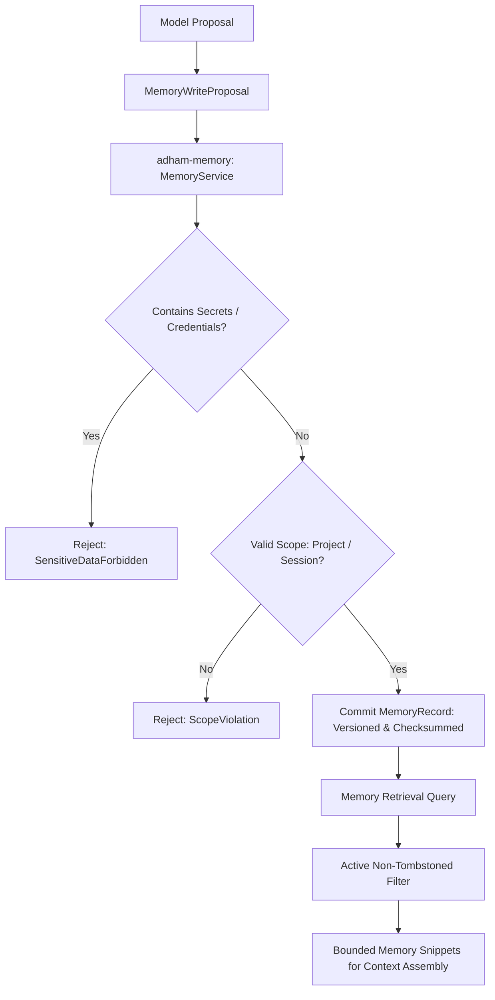

# P0-12 Governed Local Memory Contract Plan

**Specification:** [`docs/spec/p0/P0-12 — Governed local memory contract.md`](file:///c:/Users/IronMan/Desktop/adham.si/docs/spec/p0/P0-12%20%E2%80%94%20Governed%20local%20memory%20contract.md)  
**Governing Documents:** [`AGENTS.md`](file:///c:/Users/IronMan/Desktop/adham.si/AGENTS.md), [`P0 — Implementation decisions & execution order.md`](file:///c:/Users/IronMan/Desktop/adham.si/docs/spec/p0/P0%20%E2%80%94%20Implementation%20decisions%20&%20execution%20order.md), [`P0-05 — Project-isolation threat model.md`](file:///c:/Users/IronMan/Desktop/adham.si/docs/spec/p0/P0-05%20%E2%80%94%20Project-isolation%20threat%20model.md)  
**Date:** 2026-10-07  
**Status:** **COMPLETED**  

---

## 1. Objective & Non-Negotiable Invariants

P0-12 establishes Adham's governed, user-owned local memory subsystem (`adham-memory`):
- **User-owned, explicit knowledge:** Conversation history is not automatically canonical memory. Memory stores explicitly proposed, vetted facts and preferences.
- **Strict scope isolation:**
  - `ProjectMemory`: Scoped strictly to one project ID. Cannot be queried across projects.
  - `SessionMemory`: Ephemeral facts scoped to a single conversation.
  - `PersonalPreferences`: Global user preferences (e.g. language, formatting), strictly opt-in.
- **Models propose, trusted service commits:** Models emit `MemoryWriteProposal`; trusted memory service enforces provenance, sensitivity checks, and revisioning.
- **Sensitive data exclusions:** Credentials, tokens, keys, passwords, and `.env` secrets are strictly forbidden from memory storage.
- **Immediate retrieval suppression:** Tombstoned or deleted memories are immediately excluded from future retrieval queries.

---

## 2. Technical Architecture

---

## 3. Implementation Tasks

### Task 1: Create `adham-memory` Crate & Workspace Setup
- Add `crates/adham-memory` to root `Cargo.toml`.
- Dependencies: `adham-core-types`, `adham-platform`, `serde`, `serde_json`, `thiserror`, `uuid`, `blake3`, `tokio`.

### Task 2: Domain Layer (`crates/adham-memory/src/domain/`)
- `scope.rs`: `MemoryScope` (`Project(ProjectId)`, `Session(SessionId)`, `Personal`), `MemoryId`.
- `record.rs`: `MemoryRecord`, `MemoryKind` (Fact, Decision, Constraint, Preference), `Provenance`.
- `proposal.rs`: `MemoryWriteProposal`, content sanitization, secret/token rejection.
- `tombstone.rs`: `TombstoneRecord`, deletion reasons, generation tracking.

### Task 3: Memory Store & Service (`crates/adham-memory/src/store/`)
- `memory_store.rs`: In-memory and persistent SQLite-backed scoped memory repository.
- `service.rs`: `MemoryService` executing writes, updates, tombstoning, and scoped retrieval queries.

### Task 4: Comprehensive Test Suite (`crates/adham-memory/tests/`)
- `scope_isolation_tests.rs`: Project memory strictly inaccessible from other projects.
- `sanitization_tests.rs`: Automatic rejection of secrets, tokens, API keys, and passwords.
- `tombstone_tests.rs`: Immediate suppression of deleted memories from retrieval.
- `revision_tests.rs`: Versioned updates and conflict resolution.

### Task 5: Verification & Evidence
- Workspace verification (`cargo test --workspace`).
- File size audit (`node scripts/check-file-size.mjs` strictly <300 lines).
- Record evidence report in `docs/reports/p0-12-test-evidence.md`.

---

## 4. Execution Checklist

- [x] **Step 1:** Create `crates/adham-memory` and workspace registration.
- [x] **Step 2:** Implement domain entities (scope, record, proposal, tombstone).
- [x] **Step 3:** Implement memory store and memory service with sensitivity sanitization.
- [x] **Step 4:** Implement comprehensive isolation and security tests.
- [x] **Step 5:** Run workspace verification, file-size audit, and record evidence report.
