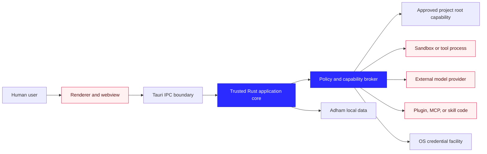

<aside>
🛡️

Adham’s primary security boundary is the project—not the visible window, current route, model, provider, or process working directory. Every access must be derived from an immutable execution identity and a trusted capability grant.

</aside>

## Scope

This threat model covers:

- Compromised renderer and malicious IPC.
- Workspace/project/session identity confusion.
- Adham global data and project-local data.
- Filesystem paths, links, junctions, reparse points, hard links, and Windows alternate streams.
- SQLite, protected content, backups, logs, and diagnostics.
- Credentials and provider requests.
- Future tools, terminal execution, browser/desktop control, MCP, skills, plugins, memory, and subagents.
- Updates, dependencies, and recovery.

The first vertical slice exposes no project-folder access, network, provider, tool, plugin, MCP, or credential capability. Those future surfaces are modeled now so the foundation does not block secure enforcement later.

# 1. Security objectives

1. Project A cannot read, modify, infer, or receive private state from Project B.
2. A renderer compromise cannot become arbitrary Rust, filesystem, SQL, shell, network, or credential access.
3. A model, tool, skill, MCP server, or plugin cannot grant itself capabilities.
4. A local-to-cloud privacy-boundary change cannot happen silently.
5. Canonical events, content, logs, backups, and diagnostics do not become uncontrolled copies of private data.
6. Cancellation, crashes, retries, and restoration do not broaden authority or duplicate side effects.
7. Organizational reporting does not imply access to underlying project files or memory.
8. Recovery fails closed while preserving the user’s ability to export safe diagnostics or restore a valid backup.

# 2. Assets

## Highest sensitivity

- Provider/API credentials.
- Private message and document content.
- Project files and source code.
- Memory and authoritative knowledge.
- Tool inputs and outputs.
- Browser sessions and desktop-control permissions.
- Encryption and wrapping keys.

## High sensitivity

- Canonical event and content databases.
- Backups and recovery copies.
- Agent instructions and hidden project context.
- Policy and approval history.
- Local paths and repository metadata.
- Generated artifacts and patches.

## Operational sensitivity

- Workspace/project/session IDs.
- Model usage and costs.
- Logs, traces, crash dumps, and diagnostics.
- Installed plugin/MCP/skill inventory.
- Application version and platform details.

Public IDs are not treated as authorization secrets.

# 3. Trust boundaries



Trusted computing base for P0:

- Rust core and reviewed first-party crates.
- Event and policy invariants.
- Tauri shell and configured IPC/capabilities.
- Platform path and credential adapters.
- SQLite library and migration logic.

Not trusted merely because it runs locally:

- Renderer JavaScript.
- AI models, including local models.
- Model-generated tool arguments.
- Project files and repository instructions.
- Skills, plugins, MCP servers, and scripts.
- Browser content.
- External providers.
- Diagnostic bundles before redaction.

# 4. Adversaries and failure sources

- Malicious third-party dependency.
- Prompt injection in files, web pages, tool results, or memory.
- Compromised renderer/XSS.
- Malicious or defective plugin/MCP server.
- Model hallucination or adversarial tool request.
- User mistake or approval fatigue.
- Another local process running as the same user.
- Low-privilege local account attempting to read Adham data.
- Cloud provider or network observer receiving unintended context.
- Crash, disk-full condition, database corruption, or failed migration.
- Race condition that swaps a path after validation.
- Contributor accidentally adding broad capabilities.

P0 does not claim protection from a fully compromised operating-system administrator or kernel. It minimizes data exposure and authority even under that limitation.

# 5. Immutable execution identity

Every operation carries:

```
installation_id
workspace_id
project_id
session_id
actor_id
request_id
correlation_id
```

Future runtime operations add:

```
agent_id
run_id
turn_id
step_id
attempt_id
```

Rules:

- Identity is constructed by the trusted application service.
- The renderer provides references; the backend verifies relationships.
- Provider clients, tools, memory, filesystem grants, budgets, and policies are resolved from the full identity.
- Switching the visible project never retargets an existing run.
- Background work remains attached to its original immutable context.
- Cross-project transfer requires an explicit handoff artifact or approved report.
- Caches are keyed by full relevant identity, not provider account, model, or visible workspace alone.

# 6. Renderer and IPC threats

## Threats

- Calling hidden commands directly.
- Supplying another project/session ID.
- Oversized payload or command flood.
- Attempting to select an actor or canonical event.
- Receiving internal errors containing paths or SQL.
- Loading remote code into a privileged window.
- Future secondary window inheriting all commands.

## Controls

- Explicit command allowlist from P0-04.
- Domain-specific commands only.
- Rust validation and relationship checks.
- Request-size, page-size, queue, rate, and timeout limits.
- Safe error envelope and redacted logging.
- No remote content in the privileged main webview.
- Strict CSP and Tauri isolation pattern when compatible.
- Window-specific capabilities and command manifest.
- No generic Tauri plugins or wildcard permissions.

Tauri notes that registered commands are available to application windows by default unless commands and capabilities are restricted; Adham must explicitly register and scope them.[[1]](https://v2.tauri.app/security/capabilities)

# 7. Global data versus project-local data

## Global Adham data

Lives only under the trusted application-data path:

- Event/content database.
- Settings and policies.
- Provider-account descriptors.
- Credential references.
- Installed extension packages and isolated extension data.
- Logs, diagnostics, staging, and backups.

## Project-local data

May later include only portable, reviewable project configuration such as:

- `AGENTS.md`.
- `.agents/skills/`.
- Portable extension references.
- Project instructions explicitly intended for source control.

Must never include:

- API keys or bearer tokens.
- OS vault material.
- Global provider credentials.
- Private memory by default.
- Runtime session database.
- Cross-project state.
- Plugin binaries or mutable plugin runtime data by default.

A project folder is untrusted input even when the user created it. Instructions and configuration from the folder cannot expand policy.

# 8. Project root capability

Future folder access is represented by an opaque capability, not a path string:

```rust
pub struct ProjectRootGrant {
    pub grant_id: GrantId,
    pub project_id: ProjectId,
    pub root_identity: RootIdentity,
    pub display_path: RedactedPath,
    pub access: RootAccess,
    pub created_at: OffsetDateTime,
    pub revalidated_at: OffsetDateTime,
}
```

`RootIdentity` records platform file identity sufficient to detect replacement where supported—for example volume identity and file identifier on Windows—not only a canonical text path.

The platform adapter owns an open directory handle or capability-oriented directory object. File operations use paths relative to that root.

Capability-oriented APIs such as `cap-std` model access through open directory capabilities rather than ambient absolute paths and should be evaluated for Adham’s filesystem broker.[[2]](https://docs.rs/cap-std/latest/cap_std/fs/index.html)

# 9. Path-resolution algorithm

For every future project-file operation:

1. Receive a validated relative project path—not an absolute OS path.
2. Reject empty/NUL-containing paths and unsupported encodings.
3. Reject absolute, device, UNC, verbatim, or drive-relative paths.
4. Reject `.` and `..` traversal after lexical normalization.
5. On Windows, reject alternate-stream syntax and reserved device names.
6. Resolve each component relative to the open root capability.
7. Default-deny symbolic links, junctions, mount points, and reparse points.
8. If a policy later permits a link, resolve and revalidate the final object identity inside an approved root.
9. Open with no-follow/reparse-safe flags where the platform supports them.
10. Verify the opened handle’s identity and type after open.
11. Perform read/write through the verified handle, not by reopening the original string.
12. Revalidate destructive operations immediately before commit.

Simple string-prefix checks are insufficient because case folding, separators, links, mount points, and path replacement can bypass them. OWASP identifies traversal as manipulation that escapes an intended root.[[3]](https://owasp.org/www-community/attacks/Path_Traversal)

# 10. Windows-specific filesystem threats

Windows is the first development platform, so these cases require explicit tests.

## Reparse points and junctions

NTFS reparse points support symbolic links, junctions, mounted folders, cloud placeholders, and other filter-controlled behavior.[[4]](https://learn.microsoft.com/en-us/windows/win32/fileio/reparse-points)

Policy:

- Default deny traversal through any reparse point.
- Enumerate and report the blocking component safely.
- Do not “canonicalize once, then open later.”
- Use handle-relative and reparse-aware operations.
- Detect root replacement or moved-folder identity changes.

## Alternate data streams

NTFS/ReFS may support named alternate data streams using stream syntax.[[5]](https://learn.microsoft.com/en-us/openspecs/windows_protocols/ms-fscc/e2b19412-a925-4360-b009-86e3b8a020c8)

Policy:

- Reject colon/stream syntax in project-relative components.
- Do not copy, execute, index, or upload alternate streams implicitly.
- Security scanning includes ADS detection for downloaded/plugin artifacts.

## Device and namespace paths

Reject input forms including:

```
\\?\
\\.\
UNC shares
C:relative-path
reserved DOS devices such as CON, PRN, AUX, NUL, COM1, LPT1
```

The project picker may later allow a network share through an explicit higher-risk policy, but the path broker does not accept a share merely because the renderer supplied one.

## Hard links

A path inside the project may reference an inode/file that has another name outside the project.

Initial policy:

- The sandbox, not path validation alone, is the primary containment layer.
- Destructive or executable operations on suspicious multi-link files require denial or explicit review.
- Tests include hard-link attempts to sensitive files on the same volume.
- Adham does not claim string-based root checks prevent hard-link aliasing.

## Case and normalization

- Compare identities/handles, not case-sensitive path strings.
- Normalize display paths separately from authorization.
- Test trailing dots/spaces, mixed separators, Unicode normalization, and case variants.

# 11. TOCTOU and handle safety

Threat:

```
validate safe path
→ attacker replaces directory with link
→ privileged operation opens escaped target
```

Controls:

- Open root once and retain capability.
- Resolve relative components using handle-relative APIs.
- Open before trust; validate the opened handle.
- Avoid check-then-reopen sequences.
- Use atomic replace for writes.
- Stage patches in Adham-owned scratch storage.
- Compare expected file identity and digest before applying a delayed patch.
- Refuse writes when the target changed since review.

# 12. File-operation policy

Future file actions declare:

- Project/root grant.
- Relative target.
- Read, create, patch, rename, or delete operation.
- Expected existing identity/hash.
- Maximum bytes.
- Link/reparse behavior.
- Reversibility and backup strategy.
- Requesting actor/agent/task.

Defaults:

- Read only inside approved root.
- Patch rather than unrestricted overwrite.
- Review file changes on by default.
- Deny delete, rename outside root, executable launch, and permission/ACL changes until separately authorized.
- Never expose the OS user’s home directory or full drive as an implicit root.

# 13. Storage, content, and backups

Threats:

- Another process reads plaintext DB content.
- Message text appears in immutable event rows.
- Logs or crash dumps copy private content.
- Copying only `adham.db` during WAL mode creates inconsistent backup.
- Restore activates modified or incompatible data.

Controls:

- Sensitive content separated from structural events.
- Application-level authenticated protection before public alpha.
- Wrapping keys stored through OS credential facility.
- User-only data-directory permissions.
- Consistent SQLite online backups.
- Backup manifests, checksums, schema verification, and quarantine restore.
- Logs exclude content and raw paths.
- Crash dumps disabled or tightly controlled for private regions where possible.
- Diagnostics preview and redaction before export.

Residual risk:

A fully compromised same-user process or OS administrator may access process memory. Adham minimizes plaintext lifetime and does not claim kernel-level isolation from the host owner.

# 14. Credentials

Threats:

- Key stored in project configuration.
- Model sees provider credential.
- Plugin/MCP server reads environment containing unrelated secrets.
- Credential reused for unapproved endpoint.
- Diagnostic export includes token.

Controls:

- Secrets stored in OS credential facility or encrypted vault.
- Core stores only credential references.
- Provider adapter obtains the secret at request time.
- Secret is injected only into the approved connection.
- Model context, event payloads, tool results, logs, and frontend never receive it.
- Plugin and MCP configurations reference secret IDs, not values.
- Endpoint and provider-account grant must match.
- Secret buffers are short-lived and zeroized where practical.

OpenShell provides a useful reference for keeping provider credentials bound to approved endpoints rather than exposing them to sandboxed agents.[[6]](https://github.com/NVIDIA/OpenShell)

# 15. Providers and network privacy

Future provider request construction follows:

```
immutable execution identity
→ authorized context selection
→ privacy classification
→ provider/account grant
→ endpoint policy
→ redaction/size checks
→ credential broker
→ outbound request
```

Controls:

- Local models and cloud models have distinct privacy classes.
- Local-to-cloud fallback requires an explicit rule or approval.
- Provider adapters receive only selected context—not the whole project.
- Redirects to unapproved origins are blocked.
- Proxy/DNS behavior is part of the network threat model.
- TLS verification cannot be disabled by model/tool input.
- Provider errors do not echo request bodies into logs.
- Budgets and rate limits are resolved from immutable scope.

# 16. Tools and sandbox

The Rust core’s path checks are not a replacement for sandboxing executable tools.

Future tool process controls:

- Separate sandbox runner process.
- Approved project mounts only.
- Read-only mounts whenever possible.
- Adham-owned ephemeral scratch space.
- Deny-by-default network egress.
- Brokered credentials.
- CPU, memory, process, time, storage, and output limits.
- Exact binary/command and working-directory policy.
- No inheritance of the entire parent environment.
- Captured, bounded, and redacted output.
- Termination of process tree on cancel.

OpenShell separates durable control-plane authority from sandbox enforcement and applies filesystem, process, network, and credential policy at the sandbox boundary.[[7]](https://docs.nvidia.com/openshell/latest/about/how-it-works.md)

# 17. Plugins, MCP, and skills

## Skills

- Treated as untrusted instructions.
- Metadata indexed first; full content loaded only after routing.
- Cannot expand permissions.
- Scripts execute only through governed tools/sandbox.
- Prompt-injection and dangerous-instruction scanning before marketplace publication.

## MCP

- Server tools begin disabled.
- Enable tools individually.
- OAuth/bearer credentials remain brokered.
- Local servers run in restricted processes.
- Remote servers use HTTPS and destination policy.
- Tool schemas and results have size limits.
- Server identity/version changes can revoke grants.

## Plugins

- Package validation before execution.
- Signature, hash, publisher, version, and permissions recorded.
- Immutable package root and separate writable plugin data.
- Third-party code excluded from trusted Rust core and main renderer.
- Declarative UI preferred; custom views isolated.
- Updates requesting new permissions pause for approval.
- Rollback and quarantine available.

# 18. Agents, graphs, and memory

## Agents and subagents

- Child session receives explicit context shard and capability subset.
- No ambient access to parent mutable state.
- Shared results use artifacts/reports.
- Cancellation token, budget, and tool registry are child-scoped.
- Cross-project agent assignment creates separate execution contexts.

## Graph

- Scheduler owns node states and leases.
- Model proposes changes; it does not mutate durable graph state directly.
- Node input references are scoped.
- Output cannot automatically become another project’s input.

## Memory

- Writes are proposals with source, authority, mutability, and scope.
- Retrieval always filters full identity and policy.
- Project memory cannot satisfy another project’s request without handoff.
- Retrieved instructions do not override system/policy layers.
- Locked authoritative sources are read-only to agents.
- Deletion removes protected content and leaves only permitted structural tombstone/audit facts.

# 19. Diagnostics, telemetry, and support

Threats:

- User sends private bundle to maintainers.
- Paths identify people/companies.
- Crash trace contains prompts or provider bodies.
- Telemetry creates a shadow cloud history.

Controls:

- Telemetry off by default.
- No prompts, document content, memory, credentials, or raw paths.
- Diagnostics generated locally.
- Deterministic redaction pipeline.
- Preview manifest before export.
- User explicitly chooses to save/share.
- Correlation IDs remain useful without payloads.
- Redaction tests use canary secrets and private paths.

# 20. Updates and supply chain

Controls:

- Lockfiles committed.
- Dependencies audited and license-checked.
- GitHub Actions pinned by commit.
- Releases signed; update manifest signed separately.
- Update downloaded into staging and verified before activation.
- Active agent work pauses or completes before restart.
- Rollback available.
- Plugin updates cannot inherit trust when publisher/signature changes.
- SBOM generated for release builds.
- Build scripts and native dependencies receive extra review.

# 21. Threat register

| Threat | Primary control | P0 status |
| --- | --- | --- |
| Renderer appends arbitrary event | Domain commands only | Required now |
| Renderer selects another project/session | Rust relationship validation | Required now |
| IPC flood | Size/rate/queue limits | Required now |
| Private content in event log | Content references | Required now |
| Plaintext local content | Protection port/schema | Required now; production algorithm before alpha |
| Database path injection | Trusted Tauri path resolver | Required now |
| Cross-project query cache | Fully scoped query keys | Required now |
| Symlink/junction escape | Handle-relative capability + default deny | Before file tools |
| Windows ADS/device-path abuse | Reject unsupported namespace syntax | Before file tools |
| Tool escapes project | Sandbox + mounts + policy | Before tools |
| Silent cloud fallback | Privacy-class routing policy | Before cloud provider |
| Credential exposure | Vault and endpoint broker | Before provider/MCP |
| Plugin executes in core | Separate plugin host | Before plugins |
| Memory crosses projects | Scope-filtered retrieval | Before memory |
| Diagnostic leak | Redaction and preview | Before support export |
| Malicious update | Signing, staging, rollback | Before public beta |

# 22. Security test matrix

## P0 slice

- Unknown Tauri command unavailable.
- Renderer actor field rejected.
- Wrong workspace/project/session combination rejected.
- Oversized/rate-limited request performs no mutation.
- Public errors contain no SQL, content, or paths.
- Message body absent from event row and default logs.
- Query key cannot merge Project A and Project B.
- Database path cannot be supplied through IPC.
- Corrupt checksum opens recovery state.

## Before filesystem tools

- `..`, absolute, drive-relative, UNC, device, and verbatim paths.
- Mixed separators and case variants.
- Trailing dot/space and reserved device names.
- ADS syntax.
- Symlink, junction, mount point, and other reparse point.
- Root swapped after grant.
- Path component swapped between validation and open.
- Hard link to external sensitive file.
- Unicode normalization variants.
- File changed after diff approval.

## Before providers

- Redirect to unapproved host.
- Credential cannot enter request body/prompt/log.
- Local-to-cloud fallback blocked.
- Provider account not granted to project.
- Oversized/sensitive context warning and denial.

## Before plugins/MCP

- Invalid signature/hash.
- Path escapes package root.
- New permissions on update.
- Disabled tool invocation.
- Server identity/version changes.
- Plugin cannot read another plugin’s data.

# 23. Incident and recovery behavior

When an isolation violation is suspected:

1. Stop the affected task/run.
2. Revoke transient capabilities and credentials.
3. Preserve redacted structural evidence.
4. Do not continue with fallback tools/providers.
5. Mark affected extension/provider/root grant unhealthy.
6. Notify the user with exact known scope and uncertainty.
7. Offer quarantine, restore, regrant, or diagnostic export.
8. Never upload evidence automatically.

Security failure states remain distinct from ordinary task failures.

# 24. Acceptance gate

P0-05 is accepted when:

- Renderer compromise is an explicit assumption.
- Immutable execution identity and cache scoping are accepted.
- Global/project-local data boundaries are accepted.
- Project roots are capabilities, not strings.
- Default-deny link/reparse policy is accepted.
- Windows ADS, device paths, junctions, hard links, and TOCTOU cases are in the test plan.
- Credential and provider boundaries are accepted.
- Future tool/plugin/MCP/memory isolation requirements are accepted.
- Diagnostics, telemetry, backups, and recovery are included in privacy scope.
- The first slice contains no generic filesystem, network, shell, secret, raw-event, or arbitrary-service endpoint.

The next artifact is P0-06: repository scaffold execution and evidence checklist. After that gate is defined, P0-07 specifies the agent runtime state machine.